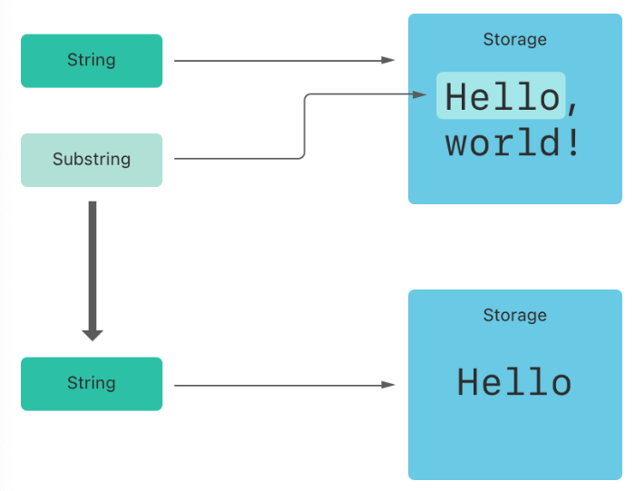
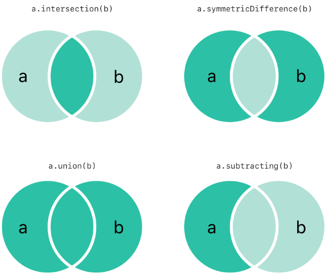
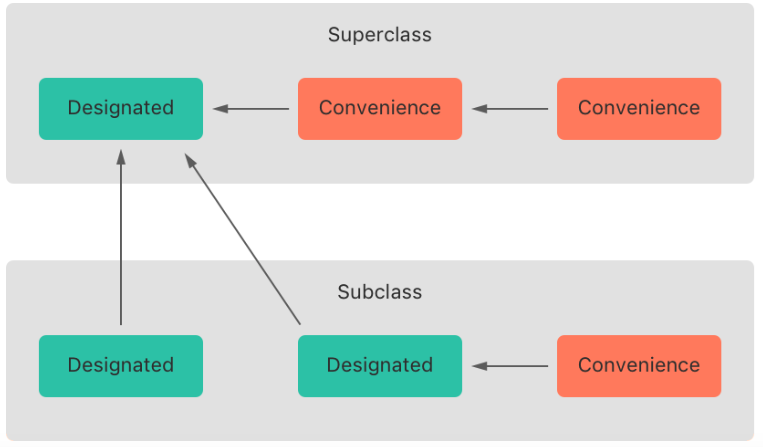

# SwiftGG

## Swift初见

1. 不需要main函数，不需要在句尾写分号

2. 常量和变量的类型不用明确声明，只需要通过赋值的变量类型，编译器会自动推断。没有初始值要在后面用冒号声明类型。值不会隐式转换为其他类型，需要显式转换。可以通过反斜杠将值转换为字符串，如：

    ```swift
    let apples = 3
    let oranges = 5
    let fruitSummary = "I have \(apples + oranges) pieces of fruit."
    // 多行字符串用三个双引号包含
    let quotation = """
    I said "I have \(apples) apples."
    And then I said "I have \(apples + oranges) pieces of fruit."
    """
    ```

3. 用方括号可以创建数组和字典（注意字典也是方括号，不是大括号）

    ```swift
    var shoppingList = ["catfish", "water", "tulips", "blue paint"]
    shoppingList[1] = "bottle of water"
    // 数组插入元素时会自动变大
    
    var occupations = [
        "Malcolm": "Captain",
        "Kaylee": "Mechanic",
    ]
    occupations["Jayne"] = "Public Relations"
    
    // 初始化空数组/字典
    let emptyArray: [String] = []
    let emptyDictionary: [String: Float] = [:]
    // 类型可以推断的情况下，可以这样写
    shoppingList = []
    occupations = [:]
    ```

4. 可选值表示可以是一个具体的值，也可以是nil，变量初始化时，在类型后加个问号就表示这个变量是可选值

    ```swift
    var optionalString: String? = "Hello"
    ```

5. 可选值由两种处理方式，一种是if let表达式，另一种是??运算符：

    ```swift
    var optionalName: String? = "John Appleseed"
    var greeting = "Hello!"
    // 如果optionalName有值，就拼到greeting中，如果没值就不处理
    if let name = optionalName {
        greeting = "Hello, \(name)"
    }
    
    let fullName: String = "John Appleseed"
    // 如果optionName有值，就用optionName，否则用fullName
    greeting = "Hello, \(optionName ?? fullName)"
    
    // 对应对象类型的可选值，使用?.来访问属性
    let optionalSquare: Square? = Square(sideLength: 2.5, name: "optional square")
    // 当optionalSquare有值，则继续执行，否则忽略后面的表达式，返回nil
    let sideLength = optionalSquare?.sideLength
    ```

6. 控制流语句if和for的条件都不需要用括号括起来，if的条件不会隐式和0做比较，所以必须是完整的布尔表达式，不能直接用某个对象判断。switch支持任意类型的数据以及各种比较操作，而且匹配到一个case后会退出switch语句，不会继续运行，不需要在每个case结尾添加break，但是必须要添加default语句。

7. for in语句的下标范围：

    ```swift
    var total = 0
    // 不包括上界
    for i in 0..<4 {
    	total += i
    }
    print(total)
    
    // 包括上界
    for i in 0...4 {
    	total += i
    }
    print(total)
    ```

8. 函数声明和创建：

    ```swift
    /*
    格式：
    func 函数名(参数标签1: 参数类型, 参数标签2: 参数类型...) -> (返回值1: 返回值类型, 返回值2: 返回值类型)
    调用格式：
    let 变量名 = 函数名(参数标签1: 参数值1, 参数标签2: 参数值2...)
    如果想调用时不写参数标签，可以在函数声明时在函数标签前添加 _
    访问返回值可以通过 变量名.返回值名 或 变量名.2（返回值下标）
    */ 
    func calculateStatistics(_ scores: [Int]) -> (min: Int, max: Int, sum: Int) {
        
    }
    let statistics = calculateStatistics([5, 3, 100, 3, 9])
    print(statistics.sum)
    print(statistics.2)
    
    // 函数嵌套
    func returnFifteen() -> Int {
        var y = 10
        func add() {
            y += 5
        }
        add()
        return y
    }
    returnFifteen()
    
    // 函数作为返回值
    func makeIncrementer() -> ((Int) -> Int) {
        func addOne(number: Int) -> Int {
            return 1 + number
        }
        return addOne
    }
    var increment = makeIncrementer()
    increment(7)
    
    // 函数作为参数
    func hasAnyMatches(list: [Int], condition: (Int) -> Bool) -> Bool {
        for item in list {
            if condition(item) {
                return true
            }
        }
        return false
    }
    func lessThanTen(number: Int) -> Bool {
        return number < 10
    }
    var numbers = [20, 19, 7, 12]
    hasAnyMatches(list: numbers, condition: lessThanTen)
    
    // 创建匿名函数
    numbers.map({
        (number: Int) -> Int in
        let result = 3 * number
        return result
    })	// 相当于给每个数乘3
    
    // 匿名函数简写
    numbers.map({ number in 3 * number })
    ```

9. 创建类

    ```swift
    class NamedShape {
        var numberOfSides: Int = 0
        var name: String
        // 构造函数
        init(name: String) {
            self.name = name
        }
        // 析构函数
        deinit {
    	}
        func simpleDescription() -> String {
            return "A shape with \(numberOfSides) sides."
        }
    }
    // 子类
    class Square: NamedShape {
        var sideLength: Double
        // 子类的构造函数写法
        init(sideLength: Double, name: String) {
            self.sideLength = sideLength
            super.init(name: name)
            numberOfSides = 4
        }
        // getter和setter写法
        var area: Double {
            get {
                return sideLength * sideLength
            } set {
                // newValue就是新值
                sideLength = sqrt(newValue)
            }
        }
        
        // 重写父类方法，用override标记，否则会报错
        override func simpleDescription() -> String {
            return "A square with sides of length \(sideLength)."
        }
    }
    
    
    class TriangleAndSquare {
        var triangle: EquilateralTriangle {
            // 属性值将发生改变时（不包括构造函数造成的改变），会调用
            willSet {
                square.sideLength = newValue.sideLength
            }
            // 属性值发生改变后，会调用
            didSet {
                
            }
        }
        var square: Square {
            willSet {
                triangle.sideLength = newValue.sideLength
            }
        }
        init(size: Double, name: String) {
            square = Square(sideLength: size, name: name)
            triangle = EquilateralTriangle(sideLength: size, name: name)
        }
    }
    ```

10. 枚举可以包含方法，通过rawValue可以访问枚举成员原始值

    ```swift
    enum Rank: Int {
        case ace = 1
        case two, three, four, five, six, seven, eight, nine, ten
        case jack, queen, king
        func simpleDescription() -> String {
            // 这里知道self是Rank类型，所以可以用.xxx访问枚举
            switch self {
            case .ace:
                return "ace"
            case .jack:
                return "jack"
            case .queen:
                return "queen"
            case .king:
                return "king"
            default:
                return String(self.rawValue)
            }
        }
    }
    // 外部需要完整的Rank.xxx访问枚举
    Rank.ace.rawValue // 值是1
    Rank.ace // 一般没有特殊情况，不需要用原始值，直接这样用枚举就行
    
    // 不同实例的相同枚举成员原始值可以不相同，比如
    enum ServerResponse {
        case result(String, String)
        case failure(String)
    }
    // 这里sucess的.failure没有赋值，而failure的.result没有赋值
    let success = ServerResponse.result("6:00 am", "8:09 pm")
    let failure = ServerResponse.failure("Out of cheese.")
    
    ```

11. 结构体和类区别在于前者是传值，后者是传引用

12. 异步函数：

    ```swift
    // 函数声明，返回值前添加async，标志为异步运行的函数
    func fetchUserID(from server: String) async -> Int {}
    // 调用时，用await调用
    let userID = await fetchUserID(from: server)
    // 用async let调用
    func connectUser(to server: String) async {
        // 两个异步函数调用
        async let userID = fetchUserID(from: server)
        async let username = fetchUsername(from: server)
        // 两个函数完成后，赋值
        let greeting = await "Hello \(username), user ID \(userID)"
        print(greeting)
    }
    // 用Task从同步代码中调用异步函数，不等待返回结果
    Task {
        await connectUser(to: "primary")
    }
    ```

13. 协议声明

    ```swift
    protocol ExampleProtocol {
        var simpleDescription: String { get }
        mutating func adjust()
    }
    // 类遵循协议
    class SimpleClass: ExampleProtocol {
        var simpleDescription: String = "A very simple class."
        var anotherProperty: Int = 69105
        // 类不用mutating，因为类中的方法可以直接修改类的属性
        func adjust() {
            simpleDescription += "  Now 100% adjusted."
        }
    }
    
    // 结构体遵循协议
    struct SimpleStructure: ExampleProtocol {
        var simpleDescription: String = "A simple structure"
        // mutating用来标记会修改结构体的方法，因为结构体本身是不可变的，调用这个方法，实际上是返回一个新的结构体实例
        mutating func adjust() {
            simpleDescription += " (adjusted)"
        }
    }
    
    // 枚举也可以遵循协议
    
    var a = SimpleClass()
    // 这样可以将一个遵循ExampleProtocol协议的对象赋值给protocolValue
    let protocolValue: ExampleProtocol = a
    // 但是protocolValue只能访问定义在协议的方法
    print(protocolValue.simpleDescription)
    // 定义在类SimpleClass中的方法不能访问，否则报错
    // print(protocolValue.anotherProperty)
    ```

14. 使用extension可以为现有类型添加功能，同时可以让扩展方法遵循协议

    ```swift
    // 给Int类型扩展方法，并让其遵循ExampleProtocol协议
    extension Int: ExampleProtocol {
        var simpleDescription: String {
            return "The number \(self)"
        }
        mutating func adjust() {
            self += 42
        }
    }
    // 调用
    print(7.simpleDescription)
    ```

15. 错误处理

    ```swift
    // 定义枚举遵循Error协议可以表示错误
    enum PrinterError: Error {
    	case outOfPaper
    	case noToner
    	case onFire
    }
    
    // 函数返回值前添加throws表示可以抛出错误的函数，函数内用throw抛出错误
    func send(job: Int, toPrinter printerName: String) throws -> String {
        // defer代码块表示函数返回前（包括抛出错误）最后需要执行的代码
        defer {
            
        }
        if printerName == "Never Has Toner" {
            throw PrinterError.noToner
        }
        return "Job sent"
    }
    
    // 外部用do-catch处理错误
    do {
        // do里调用函数时用try标记是可以抛出错误的代码
        let printerResponse = try send(job: 1440, toPrinter: "Gutenberg")
        print(printerResponse)
    } catch PrinterError.onFire {
        print("I'll just put this over here, with the rest of the fire.")
    } catch let printerError as PrinterError {
        print("Printer error: \(printerError).")
    } catch {
        // 抛出的错误如果不另外命名，默认是error
        print(error)
    }
    
    // 外部用try?处理错误，如果抛出错误，则会抛弃错误，结果为nil，否则，结果为包含函数返回值的可选值
    let printerSuccess = try? send(job: 1884, toPrinter: "Mergenthaler")
    ```

16. 在尖括号里写名字可以创建一个泛型函数或类型

    ```swift
    // 调用时参数传什么类型，Item就是什么类型
    func makeArray<Item>(repeating item: Item, numberOfTimes: Int) -> [Item] {
    }
    makeArray(repeating: "knock", numberOfTimes: 4)
    
    // 返回值后面用where指定对范型类型的限定
    // T: Sequence 类型遵循Sequence协议，即元素是同类型的序列，如全是数字的数组，遵循Sequence协议才能用for-in方法
    // T.Element: Equatable 表示序列的元素类型是可比较的
    // T.Element == U.Element 表示T和U序列的元素类型一致
    // <T: Equatable> 和 <T> ... where T: Equatable 的写法是等价的。
    func anyCommonElements<T: Sequence, U: Sequence>(_ lhs: T, _ rhs: U) -> Bool
        where T.Element: Equatable, T.Element == U.Element
    {
        
    }
    // 调用
    anyCommonElements([1, 2, 3], [3])
    ```

## 基础部份

相比于OC，Swift增加了元组类型，可以创建和传递一组数据，如用元组接受多个返回值。增加了可选类型，nil表示没有值，且nil可以用于任何类型，Swift是类型安全的语言，编译时会进行类型检查。

### 常量和变量

声明：

```swift
// 变量，冒号后面是类型注解，如果变量有初始值，Swift可以推断变量类型，不需要写类型注解
var red, green, blue: Double
// 常量，不能重复赋值
let 🐶🐮 = "dogcow"
// 常量/变量名不能包含数学符号，箭头保留Unicode码，连线和制表符，不能以数字开头，其他不限制。想用保留符，需要用`包起来
var `var` = "hahaha"
```

不能重复声明，不能改变存储值类型，变量和常量不能相互转换

### 注释

```swift
// 单行注释

/* 多行注释
   多行注释*/

// 下面是多行注释嵌套
/* 这是第一个多行注释的开头
/* 这是第二个被嵌套的多行注释 */
这是第一个多行注释的结尾 */
```

### 分号

只有想将多条独立语句写在同一行才需要添加分号

```swift
let cat = "🐱"; print(cat)
```

### 整数

获取8位无符号整数范围

```swift
let minValue = UInt8.min
let maxValue = UInt8.max
```

Int和UInt实际长度等于系统位数的整形长度

```swift
// 32位系统
Int和Int32长度相同
UInt和UInt32长度相同

// 64位系统
Int和Int64长度相同
UInt和UInt64长度相同
```

尽量不要用UInt，除非真的要存这么大的无符号数，统一用Int可以提高代码复用性

### 浮点数

Double是64位浮点数（至少15位小数），Float是32位浮点数（6位小数），优先选择Double

### 类型安全和类型判断

给变量/常量赋值字面量（直接出现在代码中的值）时可以触发类型判断

```swift
let meaningOfLife = 42		// 推测为Int类型
let pi = 3.14159			// 推测为Double类型（不会推测为Float）
let anotherPi = 3 + 0.14159 // 推测为Double类型
```

### 数字型字面量

```swift
let decimalInteger = 17
let binaryInteger = 0b10001       // 二进制的17
let octalInteger = 0o21           // 八进制的17
let hexadecimalInteger = 0x11     // 十六进制的17

let decimalDouble = 12.1875
let exponentDouble = 1.21875e1	  // 十进制，e1表示10^exp
let hexadecimalDouble = 0xC.3p0	  // 十六进制，p0表示2^exp

// 下划线和额外0增加可读性
let paddedDouble = 000123.456
let oneMillion = 1_000_000
let justOverOneMillion = 1_000_000.000_000_1
```

### 数值类型转换

```swift
let twoThousand: UInt16 = 2_000
let one: UInt8 = 1
// 因为UInt16内部实现了接收UInt8类型的构造器，所以可以将one转换成UInt16类型。没有相应的构造器，可以通过扩展（extension）添加
let twoThousandAndOne = twoThousand + UInt16(one)

let three = 3
let pointOneFourOneFiveNine = 0.14159
// 将整数转成浮点数，否则不能相加
let pi = Double(three) + pointOneFourOneFiveNine
// 将浮点数转成整数，值为3
let integerPi = Int(pi)
```

### 类的别名

```swift
typealias AudioSample = UInt16
// AudioSample相当于UInt16
var maxAmplitudeFound = AudioSample.min
```

### 布尔值

```swift
// 声明
let orangesAreOrange = true
let turnipsAreDelicious: Bool

// 注意
let i = 1
// 编译失败
if i {}
// 编译通过
if i == 1 {}
```

### 元组

元组可以将多个值组合成一个，且多个值可以是任意类型，也不要求同类型。可以用于创建简单的数据结构。结构复杂时用类或结构体

```swift
// 创建元组
let http404Error = (404, "Not Found")
// 元组元素命名
let http200Status = (statusCode: 200, description: "OK")
// 元组访问
print("The status code is \(http404Error.0)")	
print("The status code is \(http200Status.statusCode)")
// 分解元组
let (statusCode, statusMessage) = http404Error
// 只需要部份元组
let (justTheStatusCode, _) = http404Error
```

### 可选类型

Swift 的可选类型可以让你暗示*任意类型*的值缺失，并不需要一个特殊值（如OC用nil和NSNotFound暗示值缺失）。OC的nil是指向不存在对象的指针，而Swift的nil不是指针，而是确定的值，表示值缺失，可以赋值给任意类型，而不只是对象类型。

```swift
let possibleNumber = "123"
// 推测类型为Int? 即要么是Int值，要么是nil表示不包含值
let convertedNumber = Int(possibleNumber)

// 因为可选类型没有赋值，所以会自动赋值为nil
var surveyAnswer: String?

// 在可选变量名称后面添加!可以强制解析，强制解析前需要保证可选变量包含非nil值
print("convertedNumber has an integer value of \(convertedNumber!).")
```

可选绑定

```swift
// 可选绑定，假设someOptional有值，就将其值赋值给新常量constantName
if let constantName = someOptional {
    statements
}
// 如果后面不再使用可选变量，新常量命名可以和可选变量一致
if let someOptional = someOptional {
    statements
}
// 可以缩写为，表示新常量和可选变量同名，并将其隐式解包
if let someOptional {
    statement
}
// 如果statement想操作值，可以把let改成var
// if可以包含多个可选绑定，用,分开，相当于&&
if let firstNumber = Int("4"), let secondNumber = Int("42"), firstNumber < secondNumber && secondNumber < 100 {
    print("\(firstNumber) < \(secondNumber) < 100")
}
```

隐式解析可选类型：用于首次赋值后就能保证总会有值的可选类型。可以当作自动解析的可选类型来使用，使用时不用显示解析来获得可选值。假如变量可能变成nil，则不能使用隐式解析可选类型，否则运行时会出错

```swift
// 声明时用!而不是?表示是隐式解析可选类型
let assumedString: String! = "An implicitly unwrapped optional string."
// implicitString是非可选类型的String，将assumedString赋值给它时，会先强制解析
let implicitString: String = assumedString  // 不需要感叹号
// optionalString没有显式数据类型，所以将assumedString赋值给它时，并不会强制解析，optionalString的类型是String?
let optionalString = assumedString
```

### 断言和先决条件

二者区别在于断言仅在调试环境中生效，先决条件在生产环境中也生效

```swift
let age = -3
// 当不满足条件，就会输出断言信息，断言信息不需要可以不写
assert(age >= 0, "A person's age cannot be less than zero")

// 可以用if检查条件，用assertionFailure表明断言失败
if age > 10 {
    print("You can ride the roller-coaster or the ferris wheel.")
} else if age > 0 {
    print("You can ride the ferris wheel.")
} else {
    assertionFailure("A person's age can't be less than zero.")
}
```

当需要某条件为真代码才能继续执行时，可以用先决条件

```swift
precondition(index > 0, "Index must be greater than zero.")
// 和assertionFailure使用方法差不多
preconditionFailure("A person's age can't be less than zero.")
```

使用unchecked模式(-Ounchecked)编译代码，编译器不会检查先决条件，而是假定它们都是true。但fatalError总会中断执行

## 基本运算符

1. Swift的赋值运算符没有返回值，`if x = y`是无效的
2. 复合赋值运算没有返回值，`let b = a += 2`是错误的
3. 字符串可以用`+`和`+=`拼接
4. Swift可以用溢出运算符实现溢出运算，如`a &+ b`
5. Swift提供`===`表示恒等，`!==`表示不恒等，用来判断两个对象是否引用同一个对象实例
6. 元组需要元素相同，长度相同，才能比较，比较时从左到右，逐值比较。
7. 元组如果要比大小，需要保证元组的元素都能比大小，比如元组包含Bool元素，就不能比较
8. 空合运算符`a ?? b`表示a有值就解包，没有值就返回默认值b，a必须是可选类型，b和a类型必须一致，相当于`a != nil ? a! : b`
9. 区间运算符：`a...b`表示a到b包括a，b的所有值（闭区间），`a..<b`表示a到b不包括b的所有值（半开区间）
10. 单侧区间：`[2...]`表示从索引2开始到结尾的所有值区间，`[...2]`表示索引从0（因为索引最小值是0）到2的所有值区间，另外可以这样用`[..<2]`，`...5`这样表示小于等于5的所有数，可以无限延伸

## 字符串和字符

`Swift的String`类型和`OC`的`NSString`类型可以无缝桥接，一些`NSString`类型定义的方法可以直接用`String`调用。字符串是值类型，赋值传递时是值拷贝，实际编译中，只在绝对必要时才会真的复制

### 字符串字面量

```swift
// 单行
let someString = "Some string literal value"
// 多行，\是续行符，是为了增加可读性，其实不会真的添加换行符，不加续行符而用回车换行的话，会添加换行符到字符串中。前后空一行表示字符串开始和结束于换行符。注意结束引号左边的位置，各行字符串的开头必须在这个位置或这个位置右边，右多少表示该行缩进多少
let softWrappedQuotation = """

The White Rabbit put on his spectacles.  "Where shall I begin, \
please your Majesty?" he asked.

"Begin at the beginning," the King said gravely, "and go on \
till you come to the end; then stop."

"""

// 显示为单行样式
let someString = """
Some string literal value
"""
```

特殊字符

```swift
// 转义符\0, \\, \", \'
let threeDoubleQuotes = """
Escaping the first quote \"""
Escaping all three quotes \"\"\"
"""

// Unicode转义\u{n}，n是八位十六进制的可用Unicode位码
let dollarSign = "\u{24}"             // $，Unicode 标量 U+0024
let blackHeart = "\u{2665}"           // ♥，Unicode 标量 U+2665
let sparklingHeart = "\u{1F496}"      // 💖，Unicode 标量 U+1F496
```

扩展字符串分隔符

```swift
// 字符串不会换行，而是输出\n
#"Line 1 \nLine 2"#
// 字符串换行，中间#个数和两边一样就行
#"Line 1 \#nLine 2"#
##"Line 1 \##nLine 2"##
// 尾部会有三个"，而不是结束多行字符串
let threeMoreDoubleQuotationMarks = #"""
Here are three more double quotes: """
"""#
```

### 空字符串

```swift
var emptyString = "" 
var anotherEmptyString = String()
// 判空
emptyString.isEmpty
```

### 字符

```swift
let catCharacters: [Character] = ["C", "a", "t", "!", "🐱"]
let catString = String(catCharacters)
print(catString)
// 打印输出：“Cat!🐱”

// 字符拼接到字符串尾部
let exclamationMark: Character = "!"
catString.append(exclamationMark)
```

### 字符串插值

```swift
let multiplier = 3
let message = "\(multiplier) times 2.5 is \(Double(multiplier) * 2.5)"
// message 是 "3 times 2.5 is 7.5"

// 添加扩展字符串则不会解析插值，而是直接输出
print(#"Write an interpolated string in Swift using \(multiplier)."#)
// 打印 "Write an interpolated string in Swift using \(multiplier)."
```

### 字符串访问修改

```swift
let greeting = "Guten Tag!"
greeting[greeting.startIndex] // G
// endIndex比最后一个字符下标多1，before前一个
greeting[greeting.index(before: greeting.endIndex)] // !
// after后一个
greeting[greeting.index(after: greeting.startIndex)] // u
// offsetBy相对偏移
let index = greeting.index(greeting.startIndex, offsetBy: 7)
greeting[index] // a

// indices会创建一个包含全部索引的范围
for index in greeting.indices {
   print("\(greeting[index]) ", terminator: "")
}

// 插入
var welcome = "hello"
// 插入字符
welcome.insert("!", at: welcome.endIndex)
// welcome 变量现在等于 "hello!"
// 插入字符串
welcome.insert(contentsOf:" there", at: welcome.index(before: welcome.endIndex))
// welcome 变量现在等于 "hello there!"

// 删除
// 删除单个字符
welcome.remove(at: welcome.index(before: welcome.endIndex))
// welcome 现在等于 "hello there"
let range = welcome.index(welcome.endIndex, offsetBy: -6)..<welcome.endIndex
// 删除子字符串
welcome.removeSubrange(range)
// welcome 现在等于 "hello"
```

插入和删除的两个方法还可以用于`Array`，`Dictionary`和`Set`中

### 子字符串

`Substring` 是另一种类型，和`String`是不一样的，只有短时间内需要操作字符串时，才用`Substring`，需要长时间保存则需要把它转化为`String`实例

```swift
let greeting = "Hello, world!"
let index = greeting.firstIndex(of: ",") ?? greeting.endIndex
let beginning = greeting[..<index]
// beginning 的值为 "Hello"

// 把结果转化为 String 以便长期存储。
let newString = String(beginning)
```

`Substring`可以重用原`String`的内存空间，或者另一个`Substring`的内存空间，修改时不用消耗性能复制内存，因此原`String`的内存空间必须保留，也是`Substring`不适合长期存储的原因



### 字符串比较

`==`和 `!=`，如果两个字符串（或者两个字符）的可扩展的字形群集是标准相等，那就认为它们是相等的

```swift
// 下面\u{65}表示e，\u{301}表示读音；\u{E9}表示带读音标识的e，二者是相等的
// "Voulez-vous un café?" 使用 LATIN SMALL LETTER E WITH ACUTE
let eAcuteQuestion = "Voulez-vous un caf\u{E9}?"
// "Voulez-vous un café?" 使用 LATIN SMALL LETTER E and COMBINING ACUTE ACCENT
let combinedEAcuteQuestion = "Voulez-vous un caf\u{65}\u{301}?"

// 下面英语的A和俄语的A虽然看起来一致，但二者并不相等
let latinCapitalLetterA: Character = "\u{41}"
let cyrillicCapitalLetterA: Character = "\u{0410}"
```

`hasPrefix(_:)`检查字符串是否有特定前缀，`hasSuffix(_:)`检查字符串是否有特定后缀

## 集合类型

注意下标访问返回的都是可选值，下面三种集合都是值类型，但**集合赋值时，不会立刻拷贝，而是和原集合共享内存，只有集合副本被修改前才会真正拷贝**

### Arrays

Swift 的 `Array` 类型被桥接到 `Foundation` 中的 `NSArray` 类。数组中只能包含一种数据类型，可以用`Array<Element>`或`[Element]`表示，一般用后者。

创建

```swift
// 空数组
var someInts: [Int] = []
someInts.append(3)
// 已知数组元素类型，可以直接用[]赋值，其还是[Int]类型
someInts = []
// 创建带默认值的数组，等价于[0.0, 0.0, 0.0]
var threeDoubles = Array(repeating: 0.0, count: 3)
var anotherThreeDoubles = Array(repeating: 2.5, count: 3)
// 数组相加初始化
var sixDoubles = threeDoubles + anotherThreeDoubles
// 数组字面量构造数组，这里Swift会推断类型为[String]
var shoppingList = ["Eggs", "Milk"]
```

访问和修改

```swift
// 元素数量
shoppingList.count
// 判空
shoppingList.isEmpty
// 数组后添加元素
shoppingList.append("Flour")
// 数组相加
shoppingList += ["Baking Powder"]
shoppingList += ["Chocolate Spread", "Cheese", "Butter"]
// 下标访问，注意不要越界
var firstItem = shoppingList[0]
shoppingList[0] = "Six eggs"
// 下标区间修改数组，最后三个元素被替换成下面两个元素
shoppingList[4...6] = ["Bananas", "Apples"]
// insert
shoppingList.insert("Maple Syrup", at: 0)
// remove，返回被移除的元素Maple Syrup
let mapleSyrup = shoppingList.remove(at: 0)
// 返回被移除的元素Apples
let apples = shoppingList.removeLast()
```

遍历

```swift
for item in shoppingList {}
// index是索引
for (index, value) in shoppingList.enumerated() {}
```

### Sets

Swift 的 `Set` 类型被桥接到 Foundation 中的 `NSSet` 类，`Sets`存储的元素都是可哈希化的。Swift所有基本类型都是可哈希化的。如果使用自定义类型需要遵循`Hashable`协议。可以用`Set<Element>`表示，没有简化形式

创建

```swift
// 空集合
var letters = Set<Character>()
letters.insert("a")
// 已知集合元素类型，可以直接用[]赋值，其还是Set<Character> 类型
letters = []
// 用数组字面量创建集合，注意Set是不能推断的，必须显式声明
var favoriteGenres: Set = ["Rock", "Classical", "Hip hop"]
```

访问和修改

```swift
// 个数
favoriteGenres.count
// 判空
favoriteGenres.isEmpty
// 添加元素
favoriteGenres.insert("Jazz")
// 删除元素，返回删除的元素
removedGenre = favoriteGenres.remove("Rock")
// 检查集合是否包含特定值
favoriteGenres.contains("Funk")
```

遍历

```swift
for genre in favoriteGenres {}
// 从小到大排序
for genre in favoriteGenres.sorted() {}
```

集合操作

```swift
let oddDigits: Set = [1, 3, 5, 7, 9]
let evenDigits: Set = [0, 2, 4, 6, 8]
let singleDigitPrimeNumbers: Set = [2, 3, 5, 7]

// 并集
oddDigits.union(evenDigits).sorted()
// [0, 1, 2, 3, 4, 5, 6, 7, 8, 9]

// 交集
oddDigits.intersection(evenDigits).sorted()
// []

// oddDigits中不在singleDigitPrimeNumbers的数字
oddDigits.subtracting(singleDigitPrimeNumbers).sorted()
// [1, 9]

// 两不相交的集合
oddDigits.symmetricDifference(singleDigitPrimeNumbers).sorted()
// [1, 2, 9]
```



```swift
let houseAnimals: Set = ["🐶", "🐱"]
let farmAnimals: Set = ["🐮", "🐔", "🐑", "🐶", "🐱"]
let cityAnimals: Set = ["🐦", "🐭"]

// 子集
houseAnimals.isSubset(of: farmAnimals)
// true

// 父集
farmAnimals.isSuperset(of: houseAnimals)
// true

// 是否没有交集
farmAnimals.isDisjoint(with: cityAnimals)
// true
```

### Dictionry

Swift 的 `Dictionary` 类型被桥接到 Foundation 的 `NSDictionary` 类。用`Dictionary<Key, Value>`表示，简写成`[Key: Value]`。key是可哈希化的，遵循`Hashable`协议。

创建

```swift
// 空字典
var namesOfIntegers: [Int: String] = [:]
namesOfIntegers[16] = "sixteen"
// 已知字典key，value类型，创建空字典不用指定类型
namesOfIntegers = [:]
// 字典字面量创建字典，省略类型声明
var airports = ["YYZ": "Toronto Pearson", "DUB": "Dublin"]
```

访问和修改

```swift
// 个数
airports.count
// 判空
airports.isEmpty
// 检索值，返回对应值的可选类型或nil
airports["DUB"]

// 两种方法都可以添加数据，也可以修改对应key的value
airports["LHR"] = "London"
// 这个方法还会返回原值
airports.updateValue("Dublin Airport", forKey: "DUB")

// 移除键值对，后者还会返回被移除的值或返回nil
airports["APL"] = nil
airports.removeValue(forKey: "DUB")
```

遍历

```swift
// 遍历键值对
for (airportCode, airportName) in airports {}
// 仅遍历键
for airportCode in airports.keys {}
// 仅遍历值
for airportCode in airports.values {}
// 用键或值直接构造数组
let airportCodes = [String](airports.keys)
// 默认是无序的，可以先排个序
let airportNames = [String](airports.values.sorted)
```

## 控制流

### 循环

For-In循环

```swift
// 数组
let names = ["Anna", "Alex", "Brian", "Jack"]
for name in names {}
// 字典
let numberOfLegs = ["spider": 8, "ant": 6, "cat": 4]
for (animalName, legCount) in numberOfLegs {}
// 数字区间
for index in 1...5 {}
// 没用到index可以_替代
for _ in 0..<60
// stride(from:to:by:)创建带步长的半开区间刻度
for tickMark in stride(from: 0, to: 60, by: 5) {}
// stride(from:through:by:)创建带步长的闭区间刻度
for tickMark in stride(from: 0, through: 60, by: 5) {}
```

While循环

```swift
while condition {
	statements
}

repeat {
	statements
} while condition
```

### 条件

if条件必须是Bool值

```swift
if xxx {
	statements
} else if xxx {
	statements
} else {
	statements
}
```

switch语句不存在隐式的贯穿，每个case至少有一条语句，不需要写break

```swift
let anotherCharacter: Character = "a"
switch anotherCharacter {
// 要同时匹配a和A，用，分开
case "a", "A":
    print("The letter A")
default:
    print("Not the letter A")
}

// 匹配区间
switch value {
case 0:
    naturalCount = "no"
case 1..<5:
    naturalCount = "a few"
case 5..<12:
    naturalCount = "several"
default:
    naturalCount = "many"
}

// 匹配元组
switch somePoint {
case (0, 0):
    print("\(somePoint) is at the origin")
case (_, 0):
    print("\(somePoint) is on the x-axis")
case (0, _):
    print("\(somePoint) is on the y-axis")
// 元组区间
case (-2...2, -2...2):
    print("\(somePoint) is inside the box")
default:
    print("\(somePoint) is outside of the box")
}

// 值绑定，要在case语句内使用匹配值
let anotherPoint = (2, 0)
switch anotherPoint {
case (let x, 0):
    print("on the x-axis with an x value of \(x)")
case (0, let y):
    print("on the y-axis with a y value of \(y)")
// 上面两个条件可以写成复合case
// case (let distance, 0), (0, let distance):
//     print("On an axis, \(distance) from the origin")
case let (x, y):
    print("somewhere else at (\(x), \(y))")
}

// case分支用where添加额外条件
let yetAnotherPoint = (1, -1)
switch yetAnotherPoint {
case let (x, y) where x == y:
    print("(\(x), \(y)) is on the line x == y")
case let (x, y) where x == -y:
    print("(\(x), \(y)) is on the line x == -y")
case let (x, y):
    print("(\(x), \(y)) is just some arbitrary point")
}
```

### 控制转移语句

Continue 停止本次循环，重新开始下次循环

```swift
for character in puzzleInput {
    switch character {
    // 匹配到元音或空字符，不处理，其他则打印
    case "a", "e", "i", "o", "u", " ":
        continue
    default:
        puzzleOutput.append(character)
    }
}
```

Break退出循环或switch（通常用于default语句）

Fallthrough贯穿，因为switch语句匹配后不会跳到下一case，使用fallthrough则可以实现

### 带标签语句

方便显式声明控制转移语句作用的控制流

```swift
label name: while condition {
     statements
 }

gameLoop: while square != finalSquare {
    diceRoll += 1
    if diceRoll == 7 { diceRoll = 1 }
    switch square + diceRoll {
    case finalSquare:
        // 结束gameLoop循环
        break gameLoop
    case let newSquare where newSquare > finalSquare:
        // 进入下一轮gameLoop循环
        continue gameLoop
    default:
        // 合法移动，做正常的处理
        square += diceRoll
        square += board[square]
    }
}
```

### 提前退出

guard语句用来要求执行后面的代码前条件必须为真，总有一个else从句处理不满足条件的情况

```swift
guard let name = person["name"] else {
	return
}
print("Hello \(name)!")
```

### API可用性（版本）

```swift
// *表示，高于指定最低版本平台系统，都可以执行
if #available(iOS 10, macOS 10.12, *) {
    // 在 iOS 使用 iOS 10 的 API, 在 macOS 使用 macOS 10.12 的 API
} else {
    // 使用先前版本的 iOS 和 macOS 的 API
}

guard #avaliable(macOS 10.12, *) else{
    // 低版本可用行为
    return "gray"
}

// 不可用性检查
if #unavailable(iOS 10) {
	// 回滚代码
}
```

## 函数

### 格式

```swift
// 声明，'= xxx' 表示参数默认值，无参数可用 '()'，无返回值可省略 '->及后面'，返回值后面加 '?' 表示可能没有值
func 函数名(参数1名: 参数1类型 = xxx, ...) -> (返回值1类型, ...)? {
	statements
}
// 调用，多返回值时，返回值是元组
let 返回值名 = 函数名(参数1标签: 参数1值, ...)
```

### 隐式返回

当函数整个函数体是单行表达式时，会隐式返回这个表达式

```swift
func greeting(for person: String) -> String {
    "Hello, " + person + "!"
}
print(greeting(for: "Dave"))
// 打印 "Hello, Dave!"
```

### 参数标签

默认用参数名作为参数标签，函数调用时参数用的是标签，另外设置标签：

```swift
func 函数名(参数1标签 参数1名: 参数1类型, ...) {
	statements
}
// 调用
函数名(参数1标签: 参数1值, ...)

// 要想调用时忽略标签，则参数标签声明为_
func 函数名(_ 参数1名: 参数1类型, ...) {
	statements
}
// 调用
函数名(参数1值, ...)
```

### 可变参数

参数类型后面加省略号表示这是可变参数，即可接收多个该类型的参数

```swift
func arithmeticMean(_ numbers: Double...) -> Double {
    var total: Double = 0
    for number in numbers {
        total += number
    }
    return total / Double(numbers.count)
}
arithmeticMean(1, 2, 3, 4, 5)
// 返回 3.0, 是这 5 个数的平均数。
```

### 输入输出参数

参数默认是常量，不能修改。参数类型前加 inout 表示输入输出参数，可以被修改。调用时参数记得加 & 表示传地址

```swift
func swapTwoInts(_ a: inout Int, _ b: inout Int) {
    let temporaryA = a
    a = b
    b = temporaryA
}
// 调用
swapTwoInts(&someInt, &anotherInt)
```

### 函数类型

函数类型由参数类型和返回类型定义

```swift
func addTwoInts(_ a: Int, _ b: Int) -> Int {
    return a + b
}
func multiplyTwoInts(_ a: Int, _ b: Int) -> Int {
    return a * b
}
// 两个函数都是(Int, Int) -> Int类型
```

用法

```swift
var mathFunction: (Int, Int) -> Int = addTwoInts
// 重新赋值
mathFunction = multiplyTwoInts
```

作为参数

```swift
func printMathResult(_ mathFunction: (Int, Int) -> Int, _ a: Int, _ b: Int) {
    print("Result: \(mathFunction(a, b))")
}
printMathResult(addTwoInts, 3, 5)
```

作为返回值

```swift
func chooseMathFunction(add: Bool) -> (Int, Int) -> Int {
    return add ? addTwoInts : multiplyTwoInts
}
var isAdd = true
let mathFunction = chooseMathFunction(add: isAdd)
```

### 函数嵌套

嵌套函数对外界不可见，仅能在其外围函数中使用

```swift
func chooseStepFunction(backward: Bool) -> (Int) -> Int {
    func stepForward(input: Int) -> Int { return input + 1 }
    func stepBackward(input: Int) -> Int { return input - 1 }
    return backward ? stepBackward : stepForward
}
```

值捕获：

- 全局函数是一个有名字但不会捕获任何值的闭包

- 嵌套函数是一个有名字并可以捕获其封闭函数域内值的闭包

### 高阶函数

map：对给定数组每个元素，执行闭包中的映射，将映射结果放置在数组中返回。

flatMap：对给定数组的每个元素，执行闭包中的映射，对映射结果进行`合并操作，`然后将合并操作后的结果放置在数组中返回。

compactMap：对给定数组的每个元素，执行闭包中的映射，将`非空的`映射结果放置在数组中返回。

compactMap对给定数组的每个元素，执行闭包中的映射，将`非空的`映射结果-键值对放置在字典中返回。

filter：对给定数组的每个元素，执行闭包中的操作，将`符合条件的元素`放在数组中返回。

reduce：对给定数组的每个元素，执行闭包中的操作对元素进行`合并`，并将合并结果返回。

## 闭包

### 语法

```swift
{ (parameters) -> return type in
    statements
}
```

闭包参数可以是inout参数，但不能设定默认值

### 简化

以sorted方法为例，其接收一个闭包函数，该函数包括两个同类型的参数，返回一个Bool值，true表示第一个参数排在第二个参数前面，反之则返回false

```swift
let names = ["Chris", "Alex", "Ewa", "Barry", "Daniella"]

// 普通函数用法
func backward(_ s1: String, _ s2: String) -> Bool {
    return s1 > s2
}
var reversedNames = names.sorted(by: backward)

// 闭包函数用法
reversedNames = names.sorted(by: { (s1: String, s2: String) -> Bool in
    return s1 > s2
})

// 作为sorted方法参数传入，因此返回值可推断，且其由names这个字符串数组调用，所以闭包参数类型也可以推断，可简化为
reversedNames = names.sorted(by: { s1, s2 in return s1 > s2 } )

// 单行表达式隐式返回可以忽略return
reversedNames = names.sorted(by: { s1, s2 in s1 > s2 } )

// 参数名可以被缩写成$0, $1... ，使用参数名缩写可以省略参数定义
reversedNames = names.sorted(by: { $0 > $1 } )

// 由于字符串本身定义了关于大于号的实现，且也是接收两个字符串，返回一个Bool值，所以可以进一步缩写
reversedNames = names.sorted(by: >)
```

### 尾随闭包

当闭包作为函数最后一个参数时，可以把闭包写到括号外，且不用标签，如：

```swift
reversedNames = names.sorted() { $0 > $1 }
// 当闭包是唯一参数时，可以省略括号
reversedNames = names.sorted { $0 > $1 }
```

若一个函数接受多个闭包，可以省略第一个尾随闭包的参数标签，其他尾随闭包则需要标签

```swift
func loadPicture(from server: Server, completion:(Picture) -> Void,
		onFailure: () -> Void) {
	if let picture = download("photo.jpg", from: server){
		completion(picture)
	} else{
		onFailure()
	}
}

loadPicture(from: someServer){	picture in
	someView.currentPicture = picture
} onFailure: {
	print("Couldn't download the next picture.")
}
```

### 值捕获

1. 嵌套函数可以捕获其外部函数所有的参数和定义的常量及变量，捕获的变量即使在原来的作用域不存在，嵌套函数还是可以修改和访问其值，相当于存了一份拷贝
2. 将闭包赋值给类实例属性，再用该闭包访问该实例或其成员捕获该实例，会在闭包和实例间创建循环引用

3. 闭包是引用类型，无论赋值给常量还是变量，实际赋值的都是闭包的引用，将闭包赋值给两个常量/变量，两个值会指向同一闭包

### 逃逸闭包

当闭包作为参数，且在函数返回后才执行，称为逃逸闭包，用@escaping标识，比如一些异步操作函数，逃逸闭包必须显式地引用self，非逃逸闭包则不用

```swift
var completionHandlers: [() -> Void] = []
// 该参数闭包并不在函数内执行，而是添加到数组中，所以是逃逸闭包
func someFunctionWithEscapingClosure(completionHandler: @escaping () -> Void) {
    completionHandlers.append(completionHandler)
}
// 该参数闭包在函数内执行，所以是非逃逸闭包
func someFunctionWithNonescapingClosure(closure: () -> Void) {
    closure()
}

class SomeClass {
    var x = 10
    func doSomething() {
        someFunctionWithEscapingClosure { self.x = 100 }
        someFunctionWithNonescapingClosure { x = 200 }
    }
}
let instance = SomeClass()
// 非逃逸闭包立刻执行
instance.doSomething()
print(instance.x)
// 打印出“200”

// 逃逸闭包手动调用后执行
completionHandlers.first?()
print(instance.x)
// 打印出“100”
```

### 自动闭包

自动闭包用于包装传递给函数作为参数的表达式，不接收参数，被调用时会返回被包装的表达式的值。简单来说就是延迟求值，只有调用时才执行（懒加载）

```swift
var customersInLine = ["Chris", "Alex", "Ewa", "Barry", "Daniella"]
print(customersInLine.count)
// 打印出“5”

// 只做赋值操作，但并不执行
// 闭包是() -> String类型
let customerProvider = { customersInLine.remove(at: 0) }
print(customersInLine.count)
// 打印出“5”

// 真正执行
print("Now serving \(customerProvider())!")
// 打印出“Now serving Chris!”
print(customersInLine.count)
// 打印出“4”


// 等价于
func serve(customer customerProvider: () -> String) {
    print("Now serving \(customerProvider())!")
}
serve(customer: { customersInLine.remove(at: 0) } )
// 打印出“Now serving Alex!”

// 另外参数用@autoclosure标记后，可以被自动转换为闭包
func serve(customer customerProvider: @autoclosure () -> String) {
    print("Now serving \(customerProvider())!")
}
serve(customer: customersInLine.remove(at: 0))
// 打印“Now serving Ewa!”

// 逃逸闭包+自动闭包
var customerProviders: [() -> String] = []
func collectCustomerProviders(_ customerProvider: @autoclosure @escaping () -> String) {
    customerProviders.append(customerProvider)
}
collectCustomerProviders(customersInLine.remove(at: 0))
collectCustomerProviders(customersInLine.remove(at: 0))
for customerProvider in customerProviders {
    print("Now serving \(customerProvider())!")
}
// 打印“Now serving Barry!”
// 打印“Now serving Daniella!”
```

## 枚举

Swift的枚举成员创建时不会被赋一个默认的整型值，其本身就是完备的值，枚举是**值类型**，赋值给其他变量时，会先拷贝一份再赋值

### 语法

```swift
// 多行写法
enum CompassPoint {
	case north
	case south
	case east
	case west
}
// 单行写法
enum Planet {
	case mercury, venus, earth, mars, jupiter, saturn, uranus, neptune
}
// 访问
var directionToHead = CompassPoint.west
// 此时已知directionToHead类型，再赋值是可以简化为
directionToHead = .east

// 获得枚举个数
CompassPoint.allCases.count
// 遍历
for beverage in Beverage.allCases {
    statements
}
```

### Switch匹配

switch必须穷举所有情况：

```swift
switch directionToHead {
case .north:
	print("Lots of planets have a north")
case .south:
	print("Watch out for penguins")
case .east:
	print("Where the sun rises")
case .west:
	print("Where the skies are blue")
}

// 统一处理的枚举用default分支
let somePlanet = Planet.earth
switch somePlanet {
case .earth:
    print("Mostly harmless")
default:
    print("Not a safe place for humans")
}
```

对于有关联值的枚举，比如四个数字表示的UPC条形码或者一个字符串表示的QR二维码，可以这样表示

```swift
enum Barcode {
	case upc(Int, Int, Int, Int)
	case qrCode(String)
}
// 该枚举可以用来存储关联值，且同一时间只能存其中一个关联值
// switch语句
switch productBarcode {
case .upc(let numberSystem, let manufacturer, let product, let check):
    print("UPC: \(numberSystem), \(manufacturer), \(product), \(check).")
case .qrCode(let productCode):
    print("QR code: \(productCode).")
}
// 当关联值都是常量或者都是变量时，可以把let/var提到前面
case let .upc(numberSystem, manufacturer, product, check):
```

### 原始值

原始值是枚举定义时预先填充的值，始终不变，一个枚举对应一个原始值。而上面的关联值是可变的，注意区分

```swift
// 原始值类型用: 定义
enum ASCIIControlCharacter: Character {
    // 赋值原始值，原始值类型必须一致
    case tab = "\t"
    case lineFeed = "\n"
    case carriageReturn = "\r"
}

// 隐式赋值
// 整型只赋值第一个枚举
enum Planet: Int {
    case mercury = 1, venus, earth, mars, jupiter, saturn, uranus, neptune
}
// 原始值类型是String时，会隐式将枚举名作为原始值
enum CompassPoint: String {
    case north, south, east, west
}
// rawValue访问原始值
let earthsOrder = Planet.earth.rawValue
// earthsOrder 值为 3
let sunsetDirection = CompassPoint.west.rawValue
// sunsetDirection 值为 "west"

// 用原始值创建枚举，返回值是“可选类型”，下面实际赋值了Planet.uranus
let possiblePlanet = Planet(rawValue: 7)
```

### 递归枚举

递归枚举表示有一个或多个枚举成员用该枚举实例作为关联值，在枚举前用indirect标识成员可递归

```swift
// indirect 写在enum前表示所有case都可递归，也可以写在case前表示该case可递归
indirect enum ArithmeticExpression {
    case number(Int)
    case addition(ArithmeticExpression, ArithmeticExpression)
    case multiplication(ArithmeticExpression, ArithmeticExpression)
}
// 递归枚举用递归函数处理，
func evaluate(_ expression: ArithmeticExpression) -> Int {
    switch expression {
    case let .number(value):
        return value
    case let .addition(left, right):
        return evaluate(left) + evaluate(right)
    case let .multiplication(left, right):
        return evaluate(left) * evaluate(right)
    }
}
```

## 类和结构体

### 共同点

- 定义属性用于存储值
- 定义方法用于提供功能
- 定义下标操作用于通过下标语法访问它们的值
- 定义构造器用于设置初始值
- 通过扩展以增加默认实现之外的功能
- 遵循协议以提供某种标准功能

### 类附加功能

- 继承允许一个类继承另一个类的特征
- 类型转换允许在运行时检查和解释一个类实例的类型
- 析构器允许一个类实例释放任何其所被分配的资源
- 引用计数允许对一个类的多次引用
- **类是引用类型**，赋值给其他变量时，不会被拷贝，而是直接赋值其引用。当类被定义为常量时，依然可以修改结构体成员变量的值，因为改变的是其引用实例的属性，其引用的值并未改变，判断两个常量/变量是否引用同一个实例可以用恒等运算符`===`和`!==`，

### 结构体附加功能

- 成员逐一构造器
- **结构体是值类型**，赋值给其他变量时，会先拷贝一份实例再赋值。当结构体被定义为常量时，不能再修改结构体成员变量的值，即所有属性都变成了常量

优先使用更简单的结构体

### 语法

```swift
// 定义
struct Resolution {
    var width = 0
    var height = 0
}
class VideoMode {
    var resolution = Resolution()
    var interlaced = false
    var frameRate = 0.0
    var name: String?
}

// 创建实例
let someResolution = Resolution()
// 结构体会自动生成成员逐一构造器，可以用来创建实例，类没有
let vga = Resolution(width: 640, height: 480)
let someVideoMode = VideoMode()

// 属性访问
print("The width of someResolution is \(someResolution.width)")
// 打印 "The width of someVideoMode is 0"
someVideoMode.resolution.width = 1280
print("The width of someVideoMode is \(someVideoMode.resolution.width)")
// 打印 "The width of someVideoMode is now 1280"
```

## 属性

### 存储属性

类和结构体在创建实例时，必须为所有存储型属性设置合适的初始值

常量结构体的属性不能被修改

用lazy标识的属性称为延时加载存储属性，指第一次调用的时候才会计算其初始值，**延时加载属性都是var变量**。通常用于初始化较复杂或依赖外部因素的属性。**延时加载属性如果同时被多个线程访问，无法保证只初始化一次**。

Swift只有属性，没有实例变量

### 计算属性

计算属性不直接存储值，而是提供getter和setter间接获取和设置其他属性或变量的值，**计算属性都是var变量**

```swift
struct Point {
    var x = 0.0, y = 0.0
}
struct Size {
    var width = 0.0, height = 0.0
}
struct Rect {
    var origin = Point()
    var size = Size()
    // 计算属性
    var center: Point {
        get {
            let centerX = origin.x + (size.width / 2)
            let centerY = origin.y + (size.height / 2)
            return Point(x: centerX, y: centerY)
        }
        // 这里可以利用单行隐式返回省略
        // get {
        //     Point(x: origin.x + (size.width / 2), y: origin.y + (size.height / 2))
        // }
        set(newCenter) {
            origin.x = newCenter.x - (size.width / 2)
            origin.y = newCenter.y - (size.height / 2)
        }
        // 这里可以省略newCenter，用newValue访问新值
        // set {
        //     origin.x = newValue.x - (size.width / 2)
        //     origin.y = newValue.y - (size.height / 2)
        // }
    }
}
```

只实现getter不实现setter称为只读计算属性

### 属性观察器

`willSet`观察器在新值设置前调用，会将新的属性值作为常量参数传入，默认参数名`newValue`

`didSet`观察器在新值设置后调用，会将旧的属性值作为参数传入，默认参数名`oldValue`

在父类初始化方法调用之后，在子类构造器中给父类的属性赋值时，会调用父类属性的 `willSet` 和 `didSet` 观察器。而在父类初始化方法调用之前，给子类的属性赋值时不会调用子类属性的观察器。（MARK - 后面这句没看明白，后面回来看下）

当属性被设置新值时，两个属性观察器都会被调用，即使新旧值完全一样。

对于in-out属性，设置新值也会调用两个属性观察器，因为即使在函数内部使用的是参数的拷贝，但函数结束后，参数会被重新赋值

### 属性包装器

当属性需要线程安全性检查或需要在数据库存储基本数据，则要求给属性添加同样逻辑的代码，使用属性包装器可以只编写一次管理代码，就能应用到多个属性

```swift
// @propertyWrapper用来表明这是个属性包装器
@propertyWrapper
struct SmallNumber {
    private var number: Int
    private var maximum: Int
    // 管理属性行为
    var wrappedValue: Int {
        get { return number }
        set { number = min(newValue, maximum) }
    }
    // 当没有设定初始值时，会使用init()设置
    init() {
        maximum = 12
        number = 0
    }
    init(wrappedValue: Int) {
        maximum = 12
        number = min(wrappedValue, maximum)
    }
    init(wrappedValue: Int, maximum: Int) {
        self.maximum = maximum
        number = min(wrappedValue, maximum)
    }
}

struct SmallCube {
    // 应用属性包装器
    @SmallNumber var length: Int
    @SmallNumber var height: Int = 1
    @SmallNumber(wrappedValue: 3, maximum: 4) var width: Int
}

length是0，height是1，width是3
```

属性包装器可以通过被呈现值暴露一些功能，比如上面的SmallNumber，添加被呈现值projectedValue，用来存储数值是否因为过大被调整过

```swift
@propertyWrapper
struct SmallNumber {
    private var number: Int
    private(set) var projectedValue: Bool

    var wrappedValue: Int {
        get { return number }
        set {
            if newValue > 12 {
                number = 12
                projectedValue = true
            } else {
                number = newValue
                projectedValue = false
            }
        }
    }

    init() {
        self.number = 0
        self.projectedValue = false
    }
}

struct SmallCube {
    // 应用属性包装器
    @SmallNumber var length: Int
    @SmallNumber var height: Int = 1
    @SmallNumber(wrappedValue: 3, maximum: 4) var width: Int
    mutating func resize(to size: Size) -> Bool {
        switch size {
        case .small:
            height = 10
            width = 20
        case .large:
            height = 100
            width = 100
        }
        // 结构体内部可以省略self.访问被呈现值
        return $height || $width
    }
}

// 在变量前添加$访问变量的被呈现值
var cube = SmallCube()
cube.length = 4
print(cube.$length)
// 打印 false
cube.length = 55
print(cube.$length)
// 打印true
```

### 全局变量和局部变量

全局变量/常量都是延迟计算的，和延时加载存储属性相似，但不用lazy修饰

局部变量/常量从不延迟计算。局部变量都是存储型变量，可以用属性包装器，全局变量和计算型变量不能。

### 类型属性

类型属性是指同类型的实例共享的属性（类似于静态常量），无论有多少个实例，类型属性都只有唯一一份。存储型类型属性可以是常量和变量，计算型类型属性只能是变量。

因为类型本身没有构造器，所以类型属性不能在类型初始化过程中赋值。存储型类型属性是延时初始化的，首次访问才会初始化，多线程同时访问也能保证只初始化一次，不需要lazy修饰

类型属性用static关键字来定义，通过类型本身来访问，结构体/类/枚举都可以定义类型属性：

```swift
struct SomeStructure {
    static var storedTypeProperty = "Some value."
    static var computedTypeProperty: Int {
        return 1
    }
}
enum SomeEnumeration {
    static var storedTypeProperty = "Some value."
    static var computedTypeProperty: Int {
        return 6
    }
}
class SomeClass {
    static var storedTypeProperty = "Some value."
    static var computedTypeProperty: Int {
        return 27
    }
    // 在类中改用class定义计算型类型属性，可以支持子类重写父类的实现
    class var overrideableComputedTypeProperty: Int {
        return 107
    }
}

// 访问
SomeClass.storedTypeProperty
```

## 方法

### 实例方法

实例方法定义在其所属类型的大括号间，能隐式访问其所属类型的所有其他实例方法和属性，只能被所属类型的具体实例调用（点语法）

```swift
class Counter {
    var count = 0
    func increment() {
        count += 1
    }
}
let counter = Counter()
counter.increment()
```

在实例方法中，使用已知属性和方法不用显示声明self，当实例方法的某个参数名与实例某个属性名相同时，参数名享有优先权，此时引用属性就需要用self来区分

在结构体和枚举两种值类型中，要想在实例方法中修改其属性，需要为方法声明mutating，如果值类型声明为常量，则不能调用mutating方法

```swift
struct Point {
    var x = 0.0, y = 0.0
    mutating func moveBy(x deltaX: Double, y deltaY: Double) {
        x += deltaX
        y += deltaY
    }
    // mutating方法也可以直接给self赋一个全新的实例
    // mutating func moveBy(x deltaX: Double, y deltaY: Double) {
    //     self = Point(x: x + deltaX, y: y + deltaY)
    // }
}
var somePoint = Point(x: 1.0, y: 1.0)
somePoint.moveBy(x: 2.0, y: 3.0)
print("The point is now at (\(somePoint.x), \(somePoint.y))")
// 打印“The point is now at (3.0, 4.0)”
```

枚举类型的mutating方法可以将self设置成其他枚举成员

```swift
enum TriStateSwitch {
    case off, low, high
    mutating func next() {
        switch self {
        case .off:
            self = .low
        case .low:
            self = .high
        case .high:
            self = .off
        }
    }
}
```

### 类型方法

类型方法只能由类本身调用，声明时用static表示，类的类型方法还可以用class声明，用以允许子类重写方法实现。

```swift
class SomeClass {
    class func someTypeMethod() {
        // 在这里实现类型方法
    }
}
// 调用
SomeClass.someTypeMethod()
```

在类型方法中，self指类本身，可以用self消除类型属性和类型方法参数的歧义。类型方法可以直接被本类的其他类型方法和类型属性引用，不用在前面添加类型名称

```swift
// 等级
struct LevelTracker {
    static var highestUnlockedLevel = 1
    var currentLevel = 1
    // 当前所有玩家的最大等级
    static func unlock(_ level: Int) {
        if level > highestUnlockedLevel { highestUnlockedLevel = level }
    }
    // 当前等级是否被解锁
    static func isUnlocked(_ level: Int) -> Bool {
        return level <= highestUnlockedLevel
    }
    
    // 表示可以忽略返回值
    @discardableResult
    mutating func advance(to level: Int) -> Bool {
        if LevelTracker.isUnlocked(level) {
            currentLevel = level
            return true
        } else {
            return false
        }
    }
}
// 玩家
class Player {
    var tracker = LevelTracker()
    let playerName: String
    // 达到某等级
    func complete(level: Int) {
        // 为所有玩家解锁最大等级
        LevelTracker.unlock(level + 1)
        // 完成升级
        tracker.advance(to: level + 1)
    }
    init(name: String) {
        playerName = name
    }
}

// 创建玩家1
var player = Player(name: "Argyrios")
// 完成等级1，自动升级
player.complete(level: 1)
print("highest unlocked level is now \(LevelTracker.highestUnlockedLevel)")
// 打印“highest unlocked level is now 2”

// 创建玩家2
// 直接完成等级6，会失败
if player.tracker.advance(to: 6) {
    print("player is now on level 6")
} else {
    print("level 6 has not yet been unlocked")
}
// 打印“level 6 has not yet been unlocked”
```

## 下标

下标用`subscript`关键字定义，可以设定为读写或只读，下标接受和返回的都是可选类型，入参和返回值数量都不限，且可以是任何类型，并可为它们提供默认值，但不能用in-out参数

```swift
subscript(index: Int) -> Int {
    get {
      // 返回一个适当的 Int 类型的值
    }
    set(newValue) {
      // 执行适当的赋值操作
    }
}
// 只读可以省略get和其大括号
subscript(index: Int) -> Int {
    // 返回一个适当的 Int 类型的值
}

// 多参下标实例
struct Matrix {
    let rows: Int, columns: Int
    // 将一维数组扩展为二唯
    var grid: [Double]
    init(rows: Int, columns: Int) {
        self.rows = rows
        self.columns = columns
        grid = Array(repeating: 0.0, count: rows * columns)
    }
    func indexIsValid(row: Int, column: Int) -> Bool {
        return row >= 0 && row < rows && column >= 0 && column < columns
    }
    subscript(row: Int, column: Int) -> Double {
        get {
            assert(indexIsValid(row: row, column: column), "Index out of range")
            return grid[(row * columns) + column]
        }
        set {
            assert(indexIsValid(row: row, column: column), "Index out of range")
            grid[(row * columns) + column] = newValue
        }
    }
}
```

类或结构体提供多个下标实现时，可通过入参数量和类型区分。

类型下标用static关键字定义

```swift
enum Planet: Int {
    case mercury = 1, venus, earth, mars, jupiter, saturn, uranus, neptune
    static subscript(n: Int) -> Planet {
        return Planet(rawValue: n)!
    }
}
let mars = Planet[4]
print(mars)
```

## 继承

### 基类

Swift的类不用继承通用基类，没有指定父类就是基类

```swift
class Vehicle {
    var currentSpeed = 0.0
    var description: String {
        return "traveling at \(currentSpeed) miles per hour"
    }
    func makeNoise() {
        // 什么也不做——因为车辆不一定会有噪音
    }
}
```

### 子类

子类继承父类所有属性和方法，可以用super关键字访问父类的方法和属性。并可以进行扩展和重写。

重写的方法和属性需要声明override，否则会报错，重写属性时，需要明确属性名和类型，可以把继承的只读属性重写为读写属性，但不能把继承的读写属性重写为只读属性，重写属性的setter，还需要提供getter。可以为继承的属性添加属性观察器，但如果属性是常量存储类型或只读计算类型，则不可以

```swift
class Car: Vehicle {
    var gear = 1
    override func makeNoise() {
        print("Car Noise")
    }
    override var description: String {
        return super.description + " in gear \(gear)"
    }
    override var currentSpeed: Double {
        didSet {
            gear = Int(currentSpeed / 10.0) + 1
        }
    }
}
```

将属性，方法或下标标记为final可以避免被重写，在class前添加final可以避免类被继承

## 构造过程

### 存储属性

存储属性在类或结构体实例创建时必须被设置，可以定义时分配初始值，也可以在构造器中设置，如果属性总用相同初始值，则定义时分配更简洁且能推断属性类型。

```swift
struct People {
    // 定义时分配
	var age = 0
    var name: String
    // 构造器设置
    init() {
        name = "Petter"
    }
}
```

### 自定义构造过程

构造器主要通过形参命名和类型来确定，如果定义构造器时没有提供实参标签，Swift会自动生成一个。构造器定义了实参标签，调用时就必须使用，否则会报错，如果定义时标签用_标识，则可以不用标签调用构造器

```swift
struct Color {
    let red, green, blue: Double
    init(red: Double, green: Double, blue: Double) {
        self.red   = red
        self.green = green
        self.blue  = blue
    }
    init(_ white: Double) {
        red   = white
        green = white
        blue  = white
    }
}

let magenta = Color(red: 1.0, green: 0.0, blue: 1.0)
let halfGray = Color(0.5)
```

常量属性可以在构造器中赋值，类实例的常量属性只能在构造时修改，子类不能修改

### 默认构造器

如果结构体或类为所有属性提供了默认值，但是没有任何自定义构造器，Swift会提供一个默认构造器，默认构造器将所有属性值设置为它们默认值（没提供默认值的可选类型会赋值为nil）

结构体如果没有自定义构造器，Swift会提供一个逐一成员构造器，使用逐一成员构造器时，可以省略任何有默认值的属性

注意，有了自定义构造器，默认构造器和逐一成员构造器将无法被使用，除非是通过extension添加的自定义构造器

```swift
struct Size {
    // 二者都有默认值，使用逐一成员构造器可以省略任一个
    var width = 0.0, height = 0.0
    // 没有自定义构造器，默认获得逐一成员构造器
}
let zeroByTwo = Size(height: 2.0)
print(zeroByTwo.width, zeroByTwo.height)
```

### 值类型的构造器代理

值类型的构造器不能继承，但可以用构造器代理，所谓的构造器代理，就是指构造器使用属性的构造器完成属性的实例化

```swift
struct Size {
    var width = 0.0, height = 0.0
}

struct Point {
    var x = 0.0, y = 0.0
}

struct Rect {
    var origin = Point()
    var size = Size()
    init() {}
    
    init(origin: Point, size: Size) {
        self.origin = origin
        self.size = size
    }
    
    init(center: Point, size: Size) {
        let originX = center.x - (size.width / 2)
        let originY = center.y - (size.height / 2)
        // 使用了Point的构造器代理
        self.init(origin: Point(x: originX, y: originY), size: size)
    }
}
```

### 类的继承和构造过程

类的所有存储属性，包括继承自父类的属性都需要在构造中完成初始值设置。

指定构造器是类中最主要的构造器，每个类至少有一个指定构造器，用来初始化所有属性，并调用父类的构造器沿父类链继续往上进行

便利构造器是次要的辅助型构造器，可以用来调用指定构造器并为部分形参提供默认值。用convenience标识

#### 语法

```swift
// 指定构造器
init(parameters) {
    statements
}
// 便利构造器
convenience init(parameters) {
    statements
}
```

#### 类的构造器代理

- 指定构造器必须调用其直接父类的的指定构造器。
- 便利构造器必须调用*同*类中定义的其它构造器。
- 便利构造器最后必须调用指定构造器。
- 总结：指定构造器总是向上代理，便利构造器总是横向代理



#### 两段式构造

1. 给类中每个存储属性赋一个初始值（区别于OC的是，OC这个阶段只能赋nil或0），从下往上
2. 允许给实例自定义存储属性，从上往下

#### 安全检查

1. 指定构造器保证所在类所有属性都初始化完成，才能向上代理
2. 指定构造器在给继承的属性设置新值前需要完成向上代理，否则又会被父类构造器覆盖
3. 便利构造器给任意属性赋值前，需完成其构造器的调用，否则会被覆盖
4. 构造器完成第一阶段前，实例不是完全有效的，不能调用方法和属性，不能引用self，第二阶段就可以

#### 构造器继承和重写

和OC不同，Swift子类默认不继承父类的构造器，防止父类的简单构造器被更精细的子类继承，导致没有完全或错误初始化。在子类引入的所有新属性都提供了默认值时，以下两种情况除外：

1. 子类没有定义任何指定构造器，它将自动继承父类所有的指定构造器。
2. 如果子类提供了所有父类指定构造器的实现——无论是通过规则 1 继承过来的，还是提供了自定义实现——它将自动继承父类所有的便利构造器。

编写和父类指定构造器相匹配的子类构造器时，需要带上override标识重写

因为便利构造器不能被子类继承，所以子类构造器可以直接编写和父类便利构造器相匹配的子类构造器，严格来说不属于重写，所以并不需要带上override

```swift
class Vehicle {
    var numberOfWheels = 0
    var description: String {
        return "\(numberOfWheels) wheel(s)"
    }
}

class Bicycle: Vehicle {
    var isAuto : Bool
    // 与父类默认构造器相匹配，需要加override
    override init() {
        // 阶段1，自定义子类属性
        isAuto = false
        // 向上代理，如果是调这种同步且无参数的父类指定构造器，且后面子类没有需要自定义的继承属性，这句可以省略。但如果有参数或异步的则不行，异步构造器需要明确 await super.init()
        super.init()
        // 阶段2，自定义继承于父类的属性
        numberOfWheels = 2
    }
}

// 默认构造器会创建一个numberOfWheels为0的实例
let vehicle = Vehicle()
print("Vehicle: \(vehicle.description)")
// Vehicle: 0 wheel(s)

let bicycle = Bicycle()
print("Bicycle: \(bicycle.description)")
// 打印“Bicycle: 2 wheel(s)”
```

#### 两种构造器实践

```swift
class Food {
    var name: String
    init(name: String) {
        self.name = name
    }
    
    convenience init() {
        self.init(name: "[Unnamed]")
    }
}

class RecipeIngredient: Food {
    var quantity: Int
    init(name: String, quantity: Int) {
        self.quantity = quantity
        super.init(name: name)
    }
    // 该构造器和父类构造器形参相同，所以指定override，尽管这是便利构造器，但依旧实现了父类指定的所有指定构造器，所以父类的便利构造器init()也会被继承，而且调用该便利构造器时，实际代理的是RecipeIngredient的init(name: String)构造器而不是Food的
    override convenience init(name: String) {
        self.init(name: name, quantity: 1)
    }
}

let oneMysteryItem = RecipeIngredient()	// name=Unnamed,quantity=1
let oneBacon = RecipeIngredient(name: "Bacon") // name=Bacon,quantity=1
let sixEggs = RecipeIngredient(name: "Eggs", quantity: 6) // name=Eggs,quantity=6

class ShoppingListItem: RecipeIngredient {
    // 新属性有默认值，且没有构造器，直接继承父类的所有构造器
    var purchased = false
    var description: String {
        var output = "\(quantity) x \(name)"
        output += purchased ? " ✔" : " ✘"
        return output
    }
}

var breakfastList = [
    ShoppingListItem(),
    ShoppingListItem(name: "Bacon"),
    ShoppingListItem(name: "Eggs", quantity: 6),
]
breakfastList[0].name = "Orange juice"
breakfastList[0].purchased = true
for item in breakfastList {
    print(item.description)
}
// 1 x orange juice ✔
// 1 x bacon ✘
// 6 x eggs ✘
```

### 可失败构造器

在init后面加?表示可失败构造器，return nil表示构造失败，可失败构造器参数名和参数类型不能和非可失败构造器相同。

```swift
struct Animal {
    let species: String
    init?(species: String) {
        if species.isEmpty {
        	return nil
        }
        self.species = species
    }
}
```

枚举类型可失败构造器

```swift
enum TemperatureUnit {
    case Kelvin, Celsius, Fahrenheit
    init?(symbol: Character) {
        switch symbol {
        case "K":
            self = .Kelvin
        case "C":
            self = .Celsius
        case "F":
            self = .Fahrenheit
        default:
            return nil
        }
    }
}
// 带原始值枚举类型可失败构造器
enum TemperatureUnit: Character {
    case Kelvin = "K", Celsius = "C", Fahrenheit = "F"
}
```

构造失败可以向上和横向代理到其他可失败构造器，触发构造失败后，整个构造过程会立即终止

```swift
class Product {
    let name: String
    init?(name: String) {
        if name.isEmpty { return nil }
        self.name = name
    }
}

class CartItem: Product {
    let quantity: Int
    init?(name: String, quantity: Int) {
        // 失败就不往下执行了
        if quantity < 1 { return nil }
        self.quantity = quantity
        super.init(name: name)
    }
}
```

可失败构造器重写

```swift
class Document {
    var name: String?
    // 该构造器创建了一个 name 属性的值为 nil 的 document 实例
    init() {}
    // 该构造器创建了一个 name 属性的值为非空字符串的 document 实例
    init?(name: String) {
        if name.isEmpty { return nil }
        self.name = name
    }
}

// 重写成默认name为[Untitled]的不可失败构造器
class AutomaticallyNamedDocument: Document {
    override init() {
        super.init()
        self.name = "[Untitled]"
    }
    override init(name: String) {
        super.init()
        if name.isEmpty {
            self.name = "[Untitled]"
        } else {
            self.name = name
        }
    }
}

// 子类不可失败构造器可以强制解包调用父类可失败构造器
class UntitledDocument: Document {
    override init() {
        super.init(name: "[Untitled]")!
    }
}
```

Init!可失败构造器，构造失败会触发断言，init?可以代理和重写init!，反之亦然。

### 必要构造器

构造器前添加required表示所有子类都必须实现该构造器，重写时用required关键字而不是override

```swift
class SomeClass {
    required init() {
        // 构造器的实现代码
    }
}

class SomeSubclass: SomeClass {
    required init() {
        // 构造器的实现代码
    }
}
```

如果子类继承的构造器能满足必要构造器的要求，则无须在子类中显式提供必要构造器的实现。

### 通过闭包或函数设置属性的默认值

```swift
struct Chessboard {
    // 用闭包初始化属性时，新实例被构造，闭包就会被调用，但是实例的其他部分还没有完成初始化，所以闭包内不能使用
    let boardColors: [Bool] = {
        // 内部创建类型一样的临时变量
        var temporaryBoard: [Bool] = []
        var isBlack = false
        for i in 1...8 {
            for j in 1...8 {
                temporaryBoard.append(isBlack)
                isBlack = !isBlack
            }
            isBlack = !isBlack
        }
        // 返回这个临时变量作为属性的默认值
        return temporaryBoard
        // 下面的小括号表示立即执行闭包将闭包返回值作为属性默认值，如果不加括号则会将闭包赋值给属性
    }()
    func squareIsBlackAt(row: Int, column: Int) -> Bool {
        return boardColors[(row * 8) + column]
    }
}
```

## 析构过程

只有类类型需要析构，用deinit标示，每个类最多一个

## 可选链

可选链式调用把多个可选值调用连接在一起形成调用链，其中一个节点为nil，则整个调用链都会失败

### 用可选链式调用代替强制解包

```swift
class Person {
    var residence: Residence?
}

class Residence {
    var numberOfRooms = 1
}

// 此时residence为nil
let john = Person()
// 如果强制解包，会发生运行时错误
let roomCount = john.residence!.numberOfRooms
// 如果用可选链式调用，不会出现运行时错误，原本应该返回Int类型的numberOfRooms会返回可选的Int?类型
let roomCount = john.residence?.numberOfRooms
```

### 可选链式调用访问和赋值

```swift
class Person {
    var residence: Residence?
}
class Residence {
    var rooms: [Room] = []
    var numberOfRooms: Int {
        return rooms.count
    }
    subscript(i: Int) -> Room {
        get {
            return rooms[i]
        }
        set {
            rooms[i] = newValue
        }
    }
    func printNumberOfRooms() {
        print("The number of rooms is \(numberOfRooms)")
    }
    var address: Address?
}
class Room {
    let name: String
    init(name: String) { self.name = name }
}
class Address {
    var buildingName: String?
    var buildingNumber: String?
    var street: String?
    func buildingIdentifier() -> String? {
        if buildingName != nil {
            return buildingName
        } else if let buildingNumber = buildingNumber, let street = street {
            return "\(buildingNumber) \(street)"
        } else {
            return nil
        }
    }
}

// 可选链访问属性及成功判断
if let roomCount = john.residence?.numberOfRooms {
    print("John's residence has \(roomCount) room(s).")
}
// 可选链调用方法及成功判断（即使方法没有返回值，也会返回Void?）
if john.residence?.printNumberOfRooms() != nil {
    print("It was possible to print the number of rooms.")
}
// 可选链赋值及成功判断（赋值操作同样返回Void?）
if (john.residence?.address = someAddress) != nil {
    print("It was possible to set the address.")
}
// 可选链下标访问
if let firstRoomName = john.residence?[0].name {
    print("The first room name is \(firstRoomName).")
}
// 多层可选链
if let johnsStreet = john.residence?.address?.street {
    print("John's street name is \(johnsStreet).")
}
// 在方法可选返回值上进行可选链式调用
if let beginsWithThe = john.residence?.address?.buildingIdentifier()?.hasPrefix("The") {
	statements
}


// 字典可选链访问
var testScores = ["Dave": [86, 82, 84], "Bev": [79, 94, 81]]
testScores["Dave"]?[0] = 91
testScores["Bev"]?[0] += 1
testScores["Brian"]?[0] = 72
// "Dave" 数组现在是 [91, 82, 84]，"Bev" 数组现在是 [80, 94, 81]
```

## 错误处理

错误类型需要遵循Error协议

```swift
enum VendingMachineError: Error {
    case invalidSelection                     	//选择无效
    case insufficientFunds(coinsNeeded: Int) 	//金额不足
    case outOfStock                             //缺货
}

// throw 抛出错误
throw VendingMachineError.insufficientFunds(coinsNeeded: 5)
// 函数声明时添加throws关键字表示会抛出错误
func canThrowErrors() throws -> String
// 调用时前面加try关键字
try canThrowErrors()
```

### 处理错误

1. 把函数抛出的错误传递给调用此函数的代码
2. 用 `do-catch` 语句处理错误
3. 将错误作为可选类型处理
4. 断言此错误根本不会发生

```swift
// do-catch处理错误
func nourish(with item: String) throws {
    do {
        // 可能会抛出错误
        try vendingMachine.vend(itemNamed: item)
        // 当没有错误抛出，剩下的语句会被执行
        print("Success!")
    } catch is VendingMachineError {
        // 1. 当错误未被处理时，会将其抛到它的调用方，可以不在同一个作用域处理全部错误
        print("Couldn't buy that from the vending machine.")
    }
}

do {
    try nourish(with: "Beet-Flavored Chips")
} catch {
    // 2. 但是要保证所有错误被抛到周围的作用域时都能被处理
    print("Unexpected non-vending-machine-related error: \(error)")
}

// 将错误转换成可选值
// 当抛出错误时x会被赋值为nil，否则会是函数返回值，x是返回值类型的可选类型
let x = try? someThrowingFunction()
// 实例
func fetchData() -> Data? {
    // 数据从磁盘读取成功，返回
    if let data = try? fetchDataFromDisk() { return data }
    // 数据从服务器读取成功，返回
    if let data = try? fetchDataFromServer() { return data }
    // 都失败，返回空
    return nil
}
```

`try!`调用方法可以禁用错误抛出，但是如果真抛出错误，则会出现运行时错误

### 指定清理操作

defer 语句可以指定一个代码块，保证无论是通过抛出错误还是return等语句离开，该代码块都会被执行。里面不能出现控制转移语句return，break等，也不能抛出错误。多个defer语句会按声明顺序，从后往前执行

```swift
class DeferModel {
    static func test() {
        defer {
            print("defer1 begin")
            defer {
                print("in defer 1")
            }
            print("defer1 end")
        }
        
        defer {
            print("defer2 begin")
            defer {
                print("in defer 2")
            }
            print("defer2 end")
        }
        print("do Sth in defer demo")
    }
}

// 输出：
do Sth in defer demo
defer2 begin
defer2 end
in defer 2
defer1 begin
defer1 end
in defer 1
```

## 并发

### 异步函数定义和调用

```swift
// 函数后添加async表示一步函数，当函数还抛出错误时，async要在throws前面
func listPhotos(inGallery name: String) async throws -> [String] {
    // Task.sleep什么都不做，只是等待足够时间后返回
	try await Task.sleep(until: .now + .seconds(2), clock: .continuous) 
	return ["IMG001", "IMG99", "IMG0404"]
}
// 调用时前面加await关键字表示悬点（挂起，让出线程），其他并行代码会继续执行，当方法返回后，后面的代码才会继续执行
let photoNames = await listPhotos(inGallery: "Summer Vacation")
let sortedNames = photoNames.sorted()
let name = sortedNames[0]
let photo = await downloadPhoto(named: name)
show(photo)

// 上面的方法是收到整个数组后才返回，也可以每收到一个元素就处理，这种称为异步序列
let handle = FileHandle.standardInput
for try await line in handle.bytes.lines {
    print(line)
}
// 要让类型支持for-await-in方法，需要遵循AsyncSequence协议
```

### 并行调用异步方法

```swift
// 像下面这种写法，代码会同步执行，图片会一张一张下载
let firstPhoto = await downloadPhoto(named: photoNames[0])
let secondPhoto = await downloadPhoto(named: photoNames[1])
let thirdPhoto = await downloadPhoto(named: photoNames[2])

// 要想异步执行图片下载，可以将在常量前添加async关键字，这样，三张图片的下载就是并发执行的
async let firstPhoto = downloadPhoto(named: photoNames[0])
async let secondPhoto = downloadPhoto(named: photoNames[1])
async let thirdPhoto = downloadPhoto(named: photoNames[2])
// 使用时需要用await，在这里悬点，等三张图片都在各自线程完成下载后再使用
let photos = await [firstPhoto, secondPhoto, thirdPhoto]
```

### 任务和任务组

结构化并发：同一任务组任务有相同父任务，每个任务可以添加子任务

```swift
await withTaskGroup(of: Data.self) { taskGroup in
    // 父任务
    let photoNames = await listPhotos(inGallery: "Summer Vacation")
    for name in photoNames {
        // 子任务
        taskGroup.addTask { await downloadPhoto(named: name) }
    }
}
```

非结构化并发：没有父任务。如果想创建一个在当前 actor 上运行的非结构化任务，需要调用构造器 Task.init(priority:operation:)。如果想要创建一个不在当前 actor 上运行的非结构化任务（更具体地说就是游离任务（detached task）），需要调用类方法 Task.detached(priority:operation:)。

```swift
// 创建在当前actor上运行的非结构化任务
let handle = Task {
	return await add(newPhoto, toGalleryNamed: "Spring Adventures")
}
// 执行任务
let result = await handle.value

// 检查任务是否被取消
//  被取消返回CancellationError
Task.checkCancellation()
// 或直接判断
Task.isCancelled
```

### Actors

Actors能安全地在并发代码间分享信息，actor是引用类型

```swift
actor TemperatureLogger {
    let label: String
    var measurements: [Int]
    // 只能在内部设置max
    private(set) var max: Int

    init(label: String, measurement: Int) {
        self.label = label
        self.measurements = [measurement]
        self.max = measurement
    }
    
    // 内部可以直接访问属性，不用await
    func update(with measurement: Int) {
        measurements.append(measurement)
        if measurement > max {
            max = measurement
        }
    }
}

let logger = TemperatureLogger(label: "Outdoors", measurement: 25)
// 外部访问时要加await，actor同一时间只允许一个任务访问它的可变状态，所以是可能的悬点
print(await logger.max)
```

### 可发送类型

在一个任务或在一个Actor实例中，程序包含可变状态的部分被称为并发域，能够在并发域间共享的类型被称为可发送类型（不能共享的类型是因为它们不能阻止重叠访问）。比如简单值类型，调用Actor方法的实参或任务的结果。可以让类型遵循Sendable协议来将其标记为可发送类型。可发送类型的语义要求有：

1. 该类型为值类型，且其可变状态由其它可发送数据构成——例如具有存储属性的结构体或是具有关联值的枚举

    ```swift
    // 该结构体只有可发送属性，且未被标记为public或@usableFromInline，是隐式可发送的
    struct TemperatureReading {
    	var measurement: Int
    }
    ```

2. 该类型不包含任何可变状态，且其不可变状态由其它可发送数据构成——例如只包含只读属性的结构体或类

3. 该类型包含能确保其可变状态安全的代码——例如标记了 `@MainActor` 的类或序列化了对特定线程/队列上其属性的访问的类。

## 类型转换

### 语法

```swift
// 类型定义
class MediaItem {
    var name: String
    init(name: String) {
        self.name = name
    }
}
class Movie: MediaItem {
    var director: String
    init(name: String, director: String) {
        self.director = director
        super.init(name: name)
    }
}
class Song: MediaItem {
    var artist: String
    init(name: String, artist: String) {
        self.artist = artist
        super.init(name: name)
    }
}

// is检查类型是不是属于特定子类型
let item = Movie(name: "Casablanca", director: "Michael Curtiz")
if item is Movie {
    statements
}

// 用as?或as!将类型向下转换为它的子类型
// as?转换为可选值，as！则转换类型且强制解包（能保证一定成功才用这个）
// 下面这个意思是尝试将item转换成Movie类型，如果成功就赋值给movie，否则将movie赋值为nil
if let movie = item as? Movie {
    statements
}
```

### Any和AnyObject的类型转换

Any表示任何类型，AnyObject表示任何类类型的实例

```swift
var things: [Any] = []

things.append(0)
things.append(0.0)
things.append(42)
things.append(3.14159)
things.append("hello")
things.append((3.0, 5.0))
things.append(Movie(name: "Ghostbusters", director: "Ivan Reitman"))
things.append({ (name: String) -> String in "Hello, \(name)" })

// 用is和as来找出具体类型
for thing in things {
    switch thing {
    case 0 as Int:
        print("zero as an Int")
    case 0 as Double:
        print("zero as a Double")
    case let someInt as Int:
        print("an integer value of \(someInt)")
    case let someDouble as Double where someDouble > 0:
        print("a positive double value of \(someDouble)")
    case is Double:
        print("some other double value that I don't want to print")
    case let someString as String:
        print("a string value of \"\(someString)\"")
    case let (x, y) as (Double, Double):
        print("an (x, y) point at \(x), \(y)")
    case let movie as Movie:
        print("a movie called \(movie.name), dir. \(movie.director)")
    case let stringConverter as (String) -> String:
        print(stringConverter("Michael"))
    default:
        print("something else")
    }
}
```

用Any承载可选值时，会报警告，可以用as显式转换为Any

```swift
let optionalNumber: Int? = 3
things.append(optionalNumber)        // 警告
things.append(optionalNumber as Any) // 没有警告
```

## 嵌套类型

实践：

```swift
struct BlackjackCard {

    // 嵌套的 Suit 枚举
    enum Suit: Character {
        case spades = "♠", hearts = "♡", diamonds = "♢", clubs = "♣"
    }

    // 嵌套的 Rank 枚举
    enum Rank: Int {
        // 21 点规则
        case two = 2, three, four, five, six, seven, eight, nine, ten
        case jack, queen, king, ace
        // 多层嵌套
        struct Values {
            let first: Int, second: Int?
        }
        var values: Values {
            switch self {
            // 抽到ace可以代表1点或10点
            case .ace:
                return Values(first: 1, second: 11)
            // 这三个都是10点
            case .jack, .queen, .king:
                return Values(first: 10, second: nil)
            default:
                return Values(first: self.rawValue, second: nil)
            }
        }
    }

    // BlackjackCard 的属性和方法
    let rank: Rank, suit: Suit
    // 计算型属性
    var description: String {
        var output = "suit is \(suit.rawValue),"
        output += " value is \(rank.values.first)"
        if let second = rank.values.second {
            output += " or \(second)"
        }
        return output
    }
}

// 嵌套类型初始化
let theAceOfSpades = BlackjackCard(rank: .ace, suit: .spades)
print("theAceOfSpades: \(theAceOfSpades.description)")
// 打印“theAceOfSpades: suit is ♠, value is 1 or 11”

// 引用嵌套类型Suit
let heartsSymbol = BlackjackCard.Suit.hearts.rawValue
```

## 扩展

```swift
// 方法扩展
extension SomeType {
  // 在这里给 SomeType 添加新的功能
}
// 协议扩展
extension SomeType: SomeProtocol, AnotherProtocol {
  // 协议所需要的实现写在这里
}
// 属性扩展
extension Double {
    var km: Double { return self * 1_000.0 }
    var m: Double { return self }
}
let aMarathon = 42.km + 195.m
print("A marathon is \(aMarathon) meters long")
```

### 构造器扩展

对于类，可以扩展便利构造器，不能扩展指定构造器

对于值类型，可以在扩展中使用默认构造器和成员构造器（如果有的话）

扩展的构造器也要保证创建的实例初始化完整

```swift
extension Rect {
    // 提供一个通过中心点构建Rect的构造器
    init(center: Point, size: Size) {
        let originX = center.x - (size.width / 2)
        let originY = center.y - (size.height / 2)
        self.init(origin: Point(x: originX, y: originY), size: size)
    }
}
```

### 方法扩展

```swift
extension Int {
    func repetitions(task: () -> Void) {
        for _ in 0..<self {
            task()
        }
    }
}
// 打印三次Hello！
3.repetitions {
    print("Hello!")
}

// 可变实例方法
extension Int {
    mutating func square() {
        self = self * self
    }
}
var someInt = 3
someInt.square()
// someInt 现在是 9

// 下标方法
extension Int {
    // 获取对应下标的数字
    subscript(digitIndex: Int) -> Int {
        var decimalBase = 1
        for _ in 0..<digitIndex {
            decimalBase *= 10
        }
        return (self / decimalBase) % 10
    }
}
746381295[0]
// 返回 5
746381295[1]
// 返回 9
```

### 扩展嵌套类型

```swift
// 根据数字正负类型返回
extension Int {
    enum Kind {
        case negative, zero, positive
    }
    var kind: Kind {
        switch self {
        case 0:
            return .zero
        case let x where x > 0:
            return .positive
        default:
            return .negative
        }
    }
}
```

## 协议

子类遵循协议时，要把父类名写在协议名前面

```swift
class SomeClass: SomeSuperClass, FirstProtocol, AnotherProtocol {
	// 这里是类的定义部分
}
```

### 属性要求

```swift
protocol SomeProtocol {
    // 协议总是用var声明属性，可以指定属性名和类型，以及读写权限，但不指定是存储属性还是计算属性
    // 协议要求是可读写的，实现时就不能只是可读的
    // 实例属性
	var mustBeSettable: Int { get set }
    // 虽然协议要求只是可读的，但实现时也可以添加set方法
    // 类型属性
	static var doesNotNeedToBeSettable: Int { get }
}
```

### 方法要求

```swift
// 不支持为协议中的方法提供默认参数
protocol SomeProtocol {
	// 类型方法
    static func someTypeMethod()
    // 实例方法
    func random() -> Double
}
```

### 异变方法要求

异变方法：修改值类型的方法

```swift
protocol Togglable {
    // 实现时，类类型不用加mutating前缀，值类型需要
    mutating func toggle()
}
```

### 构造器要求

```swift
protocol SomeProtocol {
    init(someParameter: Int)
}

// 在类中实现协议要求的构造器，不管是指定还是便利构造器，都需要带上required，保证子类也遵循这个协议，除非类已经被标记为了final，不能再有子类，则不需要用required
class SomeClass: SomeProtocol {
    required init(someParameter: Int) {
        // 这里是构造器的实现部分
    }
}

// 子类重写构造器时，required 和 override都要标注
class SomeSubClass: SomeClass, SomeProtocol {
    // 因为遵循协议，需要加上 required
    // 因为继承自父类，需要加上 override
    required override init(someParameter: Int) {
        // 这里是构造器的实现部分
    }
}
```

### 协议类型

协议可以当作 存在类型 来使用，比如作为方法参数/返回值，作为属性类型，作为容器元素等。

使用协议类型时，可以将其赋值为任意遵循该协议的类型

```swift
protocol RandomNumberGenerator {
    func random() -> Double
}
class LinearCongruentialGenerator: RandomNumberGenerator {
    var lastRandom = 42.0
    let m = 139968.0
    let a = 3877.0
    let c = 29573.0
    func random() -> Double {
        lastRandom = ((lastRandom * a + c).truncatingRemainder(dividingBy:m))
        return lastRandom / m
    }
}

class Dice {
    let sides: Int
    let generator: RandomNumberGenerator
    // RandomNumberGenerator协议作为类型
    init(sides: Int, generator: RandomNumberGenerator) {
        self.sides = sides
        self.generator = generator
    }
    func roll() -> Int {
        return Int(generator.random() * Double(sides)) + 1
    }
}

// 传入遵循RandomNumberGenerator协议的LinearCongruentialGenerator
var d6 = Dice(sides: 6, generator: LinearCongruentialGenerator())
for _ in 1...5 {
    print("Random dice roll is \(d6.roll())")
}
// Random dice roll is 3
// Random dice roll is 5
// Random dice roll is 4
// Random dice roll is 5
// Random dice roll is 4
```

### 委托

实例

```swift
protocol DiceGame {
    var dice: Dice { get }
    func play()
}
// 代理，用来监控游戏过程
protocol DiceGameDelegate {
    func gameDidStart(_ game: DiceGame)
    func game(_ game: DiceGame, didStartNewTurnWithDiceRoll diceRoll: Int)
    func gameDidEnd(_ game: DiceGame)
}

class SnakesAndLadders: DiceGame {
    let finalSquare = 25
    let dice = Dice(sides: 6, generator: LinearCongruentialGenerator())
    var square = 0
    var board: [Int]
    init() {
        board = Array(repeating: 0, count: finalSquare + 1)
        board[03] = +08; board[06] = +11; board[09] = +09; board[10] = +02
        board[14] = -10; board[19] = -11; board[22] = -02; board[24] = -08
    }
    // 这里需要定义为可选值
    var delegate: DiceGameDelegate?
    func play() {
        square = 0
        delegate?.gameDidStart(self)
        gameLoop: while square != finalSquare {
            let diceRoll = dice.roll()
            delegate?.game(self, didStartNewTurnWithDiceRoll: diceRoll)
            switch square + diceRoll {
            case finalSquare:
                break gameLoop
            case let newSquare where newSquare > finalSquare:
                continue gameLoop
            default:
                square += diceRoll
                square += board[square]
            }
        }
        delegate?.gameDidEnd(self)
    }
}

// 定义一个跟踪者实现跟踪协议
class DiceGameTracker: DiceGameDelegate {
    var numberOfTurns = 0
    func gameDidStart(_ game: DiceGame) {
        numberOfTurns = 0
        if game is SnakesAndLadders {
            print("Started a new game of Snakes and Ladders")
        }
        print("The game is using a \(game.dice.sides)-sided dice")
    }
    func game(_ game: DiceGame, didStartNewTurnWithDiceRoll diceRoll: Int) {
        numberOfTurns += 1
        print("Rolled a \(diceRoll)")
    }
    func gameDidEnd(_ game: DiceGame) {
        print("The game lasted for \(numberOfTurns) turns")
    }
}

let tracker = DiceGameTracker()
let game = SnakesAndLadders()
// 赋值代理
game.delegate = tracker
game.play()
// Started a new game of Snakes and Ladders
// The game is using a 6-sided dice
// Rolled a 3
// Rolled a 5
// Rolled a 4
// Rolled a 5
// The game lasted for 4 turns
```

### 扩展遵循的协议

```swift
protocol TextRepresentable {
    var textualDescription: String { get }
}
// 和原始定义中遵循协议效果是一样的
extension Dice: TextRepresentable {
    var textualDescription: String {
        return "A \(sides)-sided dice"
    }
}
```

### where关键字有条件地遵循协议

```swift
// Aarry遵循TextRepresentable的前提是元素遵循TextRepresentable协议
extension Array: TextRepresentable where Element: TextRepresentable {
    var textualDescription: String {
        let itemsAsText = self.map { $0.textualDescription }
        return "[" + itemsAsText.joined(separator: ", ") + "]"
    }
}
```

### 在扩展里声明采纳协议

当某个类型已满足某个协议的所有要求，但是还没有声明时，此时类型并不会自动遵循协议，可以通过扩展显式声明其遵循了协议

```swift
// Hamster已经遵循TextRepresentable协议
struct Hamster {
	var name: String
   	var textualDescription: String {
		return "A hamster named \(name)"
	}
}
// 在扩展里声明
extension Hamster: TextRepresentable {}

// 后面可以将Hamster当作协议类型TextRepresentable来使用
```

### 使用合成实现遵循协议

Swift为`Equatable`、`Hashable` 和 `Comparable` 协议在特定场景下提供了简单实现，不用完全编写协议全部的要求

对于Equatable协议，Swift在下面场景下提供了`==`和`!=`的合成实现：

1. 遵循Equatable协议且只有存储属性的结构体
2. 遵循Equatable协议且只有关联类型的枚举
3. 没有任何关联类型的枚举

对于Hashable协议，Swift在下面场景下提供了`hash(into:)`的合成实现：

1. 遵循Hashable协议且只有存储属性的结构体
2. 遵循Hashable协议且只有关联类型的枚举
3. 没有任何关联类型的枚举

对于Comparable协议，Swift为没有原始值的枚举提供了`<`，`<=`，`>`，`>=`的合成实现，如果枚举类型包括关联类型，关联类型也必须同时遵循Comparable协议

```swift
enum SkillLevel: Comparable {
    case beginner
    case intermediate
    case expert(stars: Int)
}
// 先定义的更小
```

### 协议类型的集合

```swift
// 可以用来存储遵循TextRepresentable协议的类型实例
let things: [TextRepresentable]
```

### 协议的继承

和类类似

```swift
// 遵循PrettyTextRepresentable的协议也必须满足TextRepresentable协议的要求
protocol PrettyTextRepresentable: TextRepresentable协议 {
    var prettyTextualDescription: String { get }
}
```

### 类专属的协议

继承列表添加AnyObject关键字，可以限制协议只能被类遵循

```swift
protocol SomeClassOnlyProtocol: AnyObject, SomeInheritedProtocol {
    // 这里是类专属协议的定义部分
}
```

### 协议合成

协议组合使用 `SomeProtocol & AnotherProtocol` 的形式

```swift
protocol Named {
    var name: String { get }
}
protocol Aged {
    var age: Int { get }
}
struct Person: Named, Aged {
    var name: String
    var age: Int
}
// 参数是遵循 Named & Aged 组合协议的类型，& 也可组合父类
func wishHappyBirthday(to celebrator: Named & Aged) {
    print("Happy birthday, \(celebrator.name), you're \(celebrator.age)!")
}
let birthdayPerson = Person(name: "Malcolm", age: 21)
wishHappyBirthday(to: birthdayPerson)
// 打印 “Happy birthday Malcolm - you're 21!”
```

### 协议的一致性

1. is检查实例是否遵循某个协议
2. as?检查实例遵循某个协议时，返回协议类型的可选值
3. as!将实例强转协议类型，失败会触发运行时错误

### optional可选的协议要求

标记`@objc`的协议只能被继承自`Objective-C`类的类或`@objc`类遵循，使用了`optional`的方法或属性，其会自动变成可选值，在可选链式调用中，都需要添加`?`

```swift
@objc protocol CounterDataSource {
    @objc optional func increment(forCount count: Int) -> Int
    @objc optional var fixedIncrement: Int { get }
}

class ThreeSource: NSObject, CounterDataSource {
    let fixedIncrement = 3
}

class TowardsZeroSource: NSObject, CounterDataSource {
    // 自身小于0就递增，大于0就递减，直到最后等于0
    func increment(forCount count: Int) -> Int {
        if count == 0 {
            return 0
        } else if count < 0 {
            return 1
        } else {
            return -1
        }
    }
}

class Counter {
    var count = 0
    var dataSource: CounterDataSource?
    func increment() {
        // 两层链式调用都要?
        if let amount = dataSource?.increment?(forCount: count) {
            count += amount
        } else if let amount = dataSource?.fixedIncrement {
            count += amount
        }
    }
}

var counter = Counter()
counter.dataSource = ThreeSource()
for _ in 1...4 {
    counter.increment()
    print(counter.count)
}
// 3
// 6
// 9
// 12

counter.count = -4
counter.dataSource = TowardsZeroSource()
for _ in 1...5 {
    counter.increment()
    print(counter.count)
}
// -3
// -2
// -1
// 0
// 0
```

### 协议扩展

```swift
// 给已有协议直接扩展，会使遵循协议的类型提供属性，方法和下标的实现
extension RandomNumberGenerator {
    func randomBool() -> Bool {
        return random() > 0.5
    }
}

let generator = LinearCongruentialGenerator()
print("Here's a random number: \(generator.random())")
// 打印 “Here's a random number: 0.37464991998171”
print("And here's a random Boolean: \(generator.randomBool())")
// 打印 “And here's a random Boolean: true”

// 也可以给协议已有方法提供默认实现
extension PrettyTextRepresentable  {
    var prettyTextualDescription: String {
        return textualDescription
    }
}

// 给协议扩展可以添加限制条件，下面限制遵循Collection协议需要集合元素遵循Equatable
extension Collection where Element: Equatable {
    // 全部元素相等
    func allEqual() -> Bool {
        for element in self {
            if element != self.first {
                return false
            }
        }
        return true
    }
}
let equalNumbers = [100, 100, 100, 100, 100]
let differentNumbers = [100, 100, 200, 100, 200]
print(equalNumbers.allEqual())
// 打印 "true"
print(differentNumbers.allEqual())
// 打印 "false"
```

## 泛型

### 泛型函数

```swift
// T是占位类型名
func swapTwoValues<T>(_ a: inout T, _ b: inout T) {
    let temporaryA = a
    a = b
    b = temporaryA
}
```

### 泛型类型

```swift
// 泛型类型的栈
struct Stack<Element> {
    var items: [Element] = []
    mutating func push(_ item: Element) {
        items.append(item)
    }
    mutating func pop() -> Element {
        return items.removeLast()
    }
}

// 泛型扩展
extension Stack {
    var topItem: Element? {
        return items.isEmpty ? nil : items[items.count - 1]
    }
}
```

### 类型约束

```swift

func findIndex<T: Equatable>(of valueToFind: T, in array:[T]) -> Int? {
    for (index, value) in array.enumerated() {
        // 注意这里用到了==，所以T需要遵循Equatable协议
        if value == valueToFind {
            return index
        }
    }
    return nil
}
```

### 关联类型

```swift
// 关联类型在协议中只提供一个占位，在被实际类型遵循时才会被指定
protocol Container {
    // 关联类型也可以添加约束
    associatedtype Item: Equatable
    mutating func append(_ item: Item)
    var count: Int { get }
    subscript(i: Int) -> Item { get }
    
    // 关联类型进一步添加where约束，迭代器的元素类型和容器的元素类型要一致
    associatedtype Iterator: IteratorProtocol where Iterator.Element == Item
    func makeIterator() -> Iterator
}

// 协议继承时，可以用where语句约束协议的关联类型
protocol ComparableContainer: Container where Item: Comparable { }

// 可以用扩展空实现让Array直接遵循Container以指定关联类型
extension Array: Container {}

// 遵循该协议时，可以将关联类型指定为范型
struct Stack<Element>: Container {
    // Stack<Element> 的原始实现部分
    var items: [Element] = []
    mutating func push(_ item: Element) {
        items.append(item)
    }
    mutating func pop() -> Element {
        return items.removeLast()
    }
    // Container 协议的实现部分
    mutating func append(_ item: Element) {
        self.push(item)
    }
    var count: Int {
        return items.count
    }
    subscript(i: Int) -> Element {
        return items[i]
    }
}

// 关联类型约束中使用协议
protocol SuffixableContainer: Container {
    // 新关联类型Suffix遵循SuffixableContainer协议，且其Item类型和容器中的Item类型相同
    associatedtype Suffix: SuffixableContainer where Suffix.Item == Item
    func suffix(_ size: Int) -> Suffix
}
// 给Stack扩展遵循的协议并实现
extension Stack: SuffixableContainer {
    func suffix(_ size: Int) -> Stack {
        var result = Stack()
        for index in (count-size)..<count {
            result.append(self[index])
        }
        return result
    }
    // 推断 suffix 结果是Stack。
}
// 可以知道，此时Item是Int类型，Suffix是Stack<Int>类型，函数suffix返回了Stack<Int>
var stackOfInts = Stack<Int>()
stackOfInts.append(10)
stackOfInts.append(20)
stackOfInts.append(30)
let suffix = stackOfInts.suffix(2)
// suffix 包含 20 和 30
```

### 泛型Where语句

```swift
// C1和C2遵循Container协议，C1和C2的Item类型相同，C1的Item符合Equatable
func allItemsMatch<C1: Container, C2: Container>
    (_ someContainer: C1, _ anotherContainer: C2) -> Bool
    where C1.Item == C2.Item, C1.Item: Equatable {
        // 检查两个容器含有相同数量的元素
        if someContainer.count != anotherContainer.count {
            return false
        }
        // 检查每一对元素是否相等
        for i in 0..<someContainer.count {
            if someContainer[i] != anotherContainer[i] {
                return false
            }
        }
        // 所有元素都匹配，返回 true
        return true
}

var stackOfStrings = Stack<String>()
stackOfStrings.push("uno")
stackOfStrings.push("dos")
stackOfStrings.push("tres")

var arrayOfStrings = ["uno", "dos", "tres"]
// 两种容器不一样，但可以比较
if allItemsMatch(stackOfStrings, arrayOfStrings) {
    print("All items match.")
} else {
    print("Not all items match.")
}
// 打印“All items match.”
```

### 具有泛型where子句的扩展

```swift
// 在扩展中要求泛型遵循Equatable协议，当Item遵循Equatable协议时，为Stack添加isTop方法
extension Stack where Element: Equatable {
    func isTop(_ item: Element) -> Bool {
        guard let topItem = items.last else {
            return false
        }
        return topItem == item
    }
}

extension Container where Item: Equatable {
    func startsWith(_ item: Item) -> Bool {
        return count >= 1 && self[0] == item
    }
}

// 在扩展中直接指定泛型的类型，当Item是Double类型时，为Container添加average方法
extension Container where Item == Double {
    func average() -> Double {
        var sum = 0.0
        for index in 0..<count {
            sum += self[index]
        }
        return sum / Double(count)
    }
}

// 上面两个扩展可以写成包含上下文关系的where分句
// 区别是上面的写法，每个扩展只能有一个统一的必备条件，下面的写法可以给每个方法分别写条件
extension Container {
    func average() -> Double where Item == Double {
        var sum = 0.0
        for index in 0..<count {
            sum += Double(self[index])
        }
        return sum / Double(count)
    }
    func startsWith(_ item: Item) -> Bool where Item: Equatable {
        return count >= 1 && self[0] == item
    }
}
```

### 泛型下标

```swift
extension Container {
    // 泛型参数 Indices 遵循Sequence协议，接收可迭代的序列，返回一个包含所有对应下标元素的数组
    subscript<Indices: Sequence>(indices: Indices) -> [Item]
    // 泛型参数的迭代器元素要求是Int类型
        where Indices.Iterator.Element == Int {
            var result: [Item] = []
            for index in indices {
                result.append(self[index])
            }
            return result
    }
}
```

## 不透明类型

### 返回不透明类型

泛型允许调用一个方法时，为这个方法的形参和返回值指定一个与实现无关的类型。而不透明类型允许函数实现时，选择一个与调用代码无关的返回类型。

```swift
protocol Shape {
    func draw() -> String
}

struct Triangle: Shape {
    var size: Int
    func draw() -> String {
        var result: [String] = []
        for length in 1...size {
            result.append(String(repeating: "*", count: length))
        }
        return result.joined(separator: "\n")
    }
}

struct FlippedShape<T: Shape>: Shape {
    // 泛型
    var shape: T
    func draw() -> String {
        let lines = shape.draw().split(separator: "\n")
        return lines.reversed().joined(separator: "\n")
    }
}
let smallTriangle = Triangle(size: 3)
// 这里用的泛型，需要将FlippedShape暴露在外，外部调用时确定泛型类型是Triangle
let flippedTriangle = FlippedShape(shape: smallTriangle)
print(flippedTriangle.draw())

struct JoinedShape<T: Shape, U: Shape>: Shape {
    var top: T
    var bottom: U
    func draw() -> String {
        return top.draw() + "\n" + bottom.draw()
    }
}

// 不透明类型的返回值
func makeTrapezoid() -> some Shape {
    let top = Triangle(size: 2)
    let middle = Square(size: 2)
    let bottom = FlippedShape(shape: top)
    let trapezoid = JoinedShape(
        top: top,
        bottom: JoinedShape(top: middle, bottom: bottom)
    )
    return trapezoid
}
// 这里用的不透明类型，不用管函数内部用了什么类型，也不用将这些类型暴露出来，只要保证返回值遵循Shape协议就行
let trapezoid = makeTrapezoid()
print(trapezoid.draw())

// 可以用不透明类型避免FlippedShape和JoinedShape暴露在外
func flip<T: Shape>(_ shape: T) -> some Shape {
    return FlippedShape(shape: shape)
}
func join<T: Shape, U: Shape>(_ top: T, _ bottom: U) -> some Shape {
    JoinedShape(top: top, bottom: bottom)
}

// ⚠️注意，一个方法的不透明返回类型需要保持一致，这也是返回协议类型和不透明类型的区别
func invalidFlip<T: Shape>(_ shape: T) -> some Shape {
    if shape is Square {
        return shape // 错误：返回类型不一致
    }
    return FlippedShape(shape: shape) // 错误：返回类型不一致
}

// 可以将Square的处理放到FlippedShape里面，然后flip方法直接用FlippedShape就行
struct FlippedShape<T: Shape>: Shape {
    var shape: T
    func draw() -> String {
        if shape is Square {
            return shape.draw()
        }
        let lines = shape.draw().split(separator: "\n")
        return lines.reversed().joined(separator: "\n")
    }
}

// 返回的不透明类型可以用泛型
func `repeat`<T: Shape>(shape: T, count: Int) -> some Collection {
    // 这里可以用泛型
    return Array<T>(repeating: shape, count: count)
}
```

### 不透明类型和协议类型的区别

前面说了二者的返回值前者保证都是一个类型的，后者只能保证返回的类型遵循协议（只返回协议类型，原返回类型会被擦除），这就导致二者返回值的操作空间不同

```swift
// 协议类型的返回值是个协议，所以不能用==，也不能嵌套
func protoFlip<T: Shape>(_ shape: T) -> Shape {
    if shape is Square {
        return shape
    }

    return FlippedShape(shape: shape)
}
let protoFlippedTriangle = protoFlip(smallTriangle)
let sameThing = protoFlip(smallTriangle)
// 错误，Shape协议没有==的声明，即使有声明，二者类型也不能保证一致，无法比较
protoFlippedTriangle == sameThing  
// 错误，因为protoFlip返回的是Shape协议，不能再作为protoFlip的形参
protoFlip(protoFlip(smallTriangle)) 
```

另外不是所有协议都能以协议类型作为函数的返回值

```swift
// 该协议内部有泛型，无法作为协议类型返回值，因为无法推断泛型类型
protocol Container {
    associatedtype Item
    var count: Int { get }
    subscript(i: Int) -> Item { get }
}
// 但是可以作为不透明类型返回值，只需要知道返回遵循Container协议的类型，但不确定具体是什么类型
func makeOpaqueContainer<T>(item: T) -> some Container {
    return [item]
}
```

## 自动引用计数

### 处理循环引用

```swift
// 弱引用解决循环引用，适用于处理两者都允许为nil的情况
class Person {
    let name: String
    init(name: String) { self.name = name }
    var apartment: Apartment?
    deinit { print("\(name) is being deinitialized") }
}

class Apartment {
    let unit: String
    init(unit: String) { self.unit = unit }
    // 弱引用
    weak var tenant: Person?
    deinit { print("Apartment \(unit) is being deinitialized") }
}

// 无主引用：类似弱引用，但通常有值（就是要确保引用的对象没有被析构），不会用可选类型，且ARC不会自动置nil。用unowned标记。适用于处理其中一个属性可以为nil，另一个不能的情况
unowned var tenant: Person
// 无主不安全引用：可以禁用运行时的安全检查，允许访问已销毁的实例原来的地址，用unowned(unsafe)标记
unowned(unsafe) var tenant: Person
// 无主可选引用：类似弱引用，区别在于需要保证引用对象合法或值为nil（可以为nil就是与无主引用的唯一区别）
unowned var tenant: Person?

// 无主引用和隐式解包可选值属性，要求一个类用无主属性，另一个类用隐式解包可选值属性，适用于两个属性都必须有值的情况
class Country {
    let name: String
    var capitalCity: City!
    init(name: String, capitalName: String) {
        self.name = name
        self.capitalCity = City(name: capitalName, country: self)
    }
}

class City {
    let name: String
    unowned let country: Country
    init(name: String, country: Country) {
        self.name = name
        self.country = country
    }
}

```

### 闭包的循环引用


## 内存安全

in-out参数的访问是长期写访问，从传入函数开始，到函数执行完结束，所以传入的in-out参数在函数执行完前不能再访问，否则会出现冲突

```swift
var stepSize = 1
func increment(_ number: inout Int) {
    number += stepSize
}
increment(&stepSize)
// 错误：stepSize 访问冲突

// 处理方法是显式拷贝一份
// 显式拷贝
var copyOfStepSize = stepSize
increment(&copyOfStepSize)
// 更新原来的值
stepSize = copyOfStepSize
// stepSize 现在的值是 2

// 往同一个函数的多个in-out参数里传入同一个变量也会冲突
func balance(_ x: inout Int, _ y: inout Int) {
    let sum = x + y
    x = sum / 2
    y = sum - x
}
var playerOneScore = 42
// 两个in-out参数传同一变量
balance(&playerOneScore, &playerOneScore)
```

结构体的mutating方法会在调用时对self进行写访问

```swift
struct Player {
    var name: String
    var health: Int
    var energy: Int
    
    static let maxHealth = 10
    mutating func shareHealth(with teammate: inout Player) {
        // 第二个参数会对self进行写访问，如果teammate参数就是self，即已经对self进行了写访问，这里就会出现访问冲突
        balance(&teammate.health, &health)
    }
}

var oscar = Player(name: "Oscar", health: 10, energy: 10)
oscar.shareHealth(with: &oscar)
// 错误：oscar 访问冲突
```

对于值类型（结构体，元组和枚举），修改某个属性就相当于修改整个值，所以访问某个属性就相当于访问了整个值

```swift
var playerInformation = (health: 10, energy: 20)
balance(&playerInformation.health, &playerInformation.energy)
// 错误：这里对playerInformation的访问会出现冲突

// 实践中，将值类型变量变成局部变量而不是全局变量，编译器就可以保证重叠访问是安全的
func someFunction() {
    var oscar = Player(name: "Oscar", health: 10, energy: 10)
    balance(&oscar.health, &oscar.energy)  // 正常
}
```

在下面的情况下，编译器可以保证结构体属性的重叠访问是安全的

1. 你访问的是实例的存储属性，而不是计算属性或类的属性
2. 结构体是本地变量的值，而非全局变量
3. 结构体要么没有被闭包捕获，要么只被非逃逸闭包捕获了

## 访问控制

## 高级运算符

### 位运算符

```swift
let initialBits: UInt8 = 0b00001111
// 取反
let invertedBits = ~initialBits // 等于 0b11110000

let firstSixBits: UInt8 = 0b11111100
let lastSixBits: UInt8  = 0b00111111
// 按位与
let middleFourBits = firstSixBits & lastSixBits // 等于 00111100

let someBits: UInt8 = 0b10110010
let moreBits: UInt8 = 0b01011110
// 按位或
let combinedbits = someBits | moreBits // 等于 11111110

let firstBits: UInt8 = 0b00010100
let otherBits: UInt8 = 0b00000101
// 按位异或
let outputBits = firstBits ^ otherBits // 等于 00010001

// 按位左/右移
let shiftBits: UInt8 = 4 // 即二进制的 00000100
shiftBits << 5           // 10000000
shiftBits >> 2           // 00000001

// 移位运算编解码
let pink: UInt32 = 0xCC6699
let redComponent = (pink & 0xFF0000) >> 16  // redComponent 是 0xCC，即 204
let greenComponent = (pink & 0x00FF00) >> 8 // greenComponent 是 0x66， 即 102
let blueComponent = pink & 0x0000FF         // blueComponent 是 0x99，即 153
```


