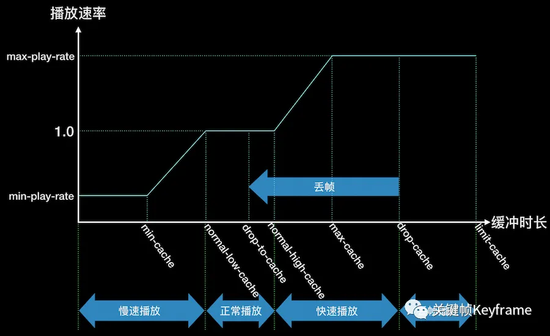

# 音视频

[toc]

## 音视频基础

### 声音的表示

#### 声音三要素

- **响度**：表示声音的大小。
- **音调**：表示声音的高低（频率）。
- **音色**：表示声音的特色。

#### 声音数字化

- **采样**：以一定采样率在时域内获取离散信号。（将话音等模拟信号每隔一段时间进行取样，使其离散化）
- **量化**：每个采样点幅度的数字化表示。（将抽样值按分层单位四舍五入去整量化）
- **编码**：以一定格式存储数据。（将抽样值按一组二进制来表示抽样脉冲的幅值）


##### 数字音频三要素

- 采样率：**奈奎斯特采样定理**，如果信号在某一有限频带范围外均为零，且采样样本足够密（一般为信号最高频率的2.56-4倍），则这些样本值能用来表征这一信号，且能从这些样本恢复信号。

    比如人声频率在5k Hz内，所以采样率为10k Hz

- 量化位深：位深表示能表示的声压值的范围，声压级（单位：分贝）计算公式
    $$
    L_p = 20 \times log_{10}\frac{P}{P_0}
    $$
    比如16bit位深能表示的最大声压级
    $$
    L_p = 20 \times log_{10}(2^{16}-1) = 96.33
    $$
    目前业界高端音频处理系统都是用32bit采样，输出时转化为16bit

- 声道数：表示声音在录制或播放时在不同空间位置采集或回放的相互独立的音频信号（扬声器数量），分为单声道，立体声，5.1声道，7.1声道

### 图像的表示

- 图像分辨率
- 像素深度

## 音视频编码（压缩）

### 音频编码

**主要是寻找音频数据中的冗余信息进行压缩**

#### 时域冗余

- 幅度分布的非均匀性：大多数音频信号，小幅度样值出现概率比大幅度样值出现概率高
- （相邻）样值间的相关性：相邻样值间存在很强的相关性，如8k Hz采样率相邻样值相关系数大于0.85。可以利用差分编码技术进行有效的数据压缩
- 信号周期间的相关性：虽然频带范围分布于20-20k Hz，但在特定瞬间，某一声音只在频带内的少数频率中存在，在周期与周期间存在一定相关性
- 静止系数：如二人通话，全双工话路（去除话音间隙，停顿）的效率为40%（静止系数为0.6）
- 长时自相关性：较长时间间隔（如几十秒）内统计的样值相关性，称为长时自相关函数，也可以压缩

#### 频域冗余

- 长时功率谱密度的非均匀性：长时功率谱密度函数呈现明显非平坦性，没有充分利用给定的频段，高频成分能量较低
- 语音特有的短时功率谱密度：某些频率上出现峰值，另一些频率出现谷值。峰值频率为能量较大的频率，称为共振峰频率，最重要的是前三个共振峰频率，由它们决定不同的语音特征。另外，整个功率谱随频率增加而递减，整个功率谱的细节以基音频率为基础，形成了高次谐波结构

#### 听觉冗余

- 将会被掩蔽的信号分量在传输之前就去除
- 不理会可能被掩蔽的量化噪声
- 将人耳不敏感的频率信号在数字化之前滤除
- 人耳掩蔽效率包括；
    1. 最小可闻阈值：小于阈值的声音能量人耳听不到
    2. 频率掩蔽效应：出现能量较大的声音时，其频率附近的其他频率的人耳可听阈值会提高很多，能量较小的声音会被掩蔽更多
    3. 时域掩蔽效应：强音信号和弱音信号同时出现，可能会发生前掩蔽（人耳听到强信号前的短暂时间，已存在的弱信号会被掩蔽），同时掩蔽（强信号与弱信号同时存在时，弱信号会被掩蔽），后掩蔽（强信号小时候需经较长一段时间才能重新听见弱信号）

#### 编码格式

- PCM，无压缩，无损编码
- WAV，无压缩，其中一种实现方式是在PCM前面添加44个字节，描述PCM的采样率、声道数、数据格式等，音质很好
- MP3，有损压缩，128Kbps以上表现不错。压缩比较高，兼容性好
- AAC，有损压缩，128Kbps以下表现优异，多用于视频中音频编码
- OPUS，有损压缩，用比MP3更小的码率实现比MP3更好的音质，高中低码率有良好表现。兼容性不好，不支持流媒体，适用于语音聊天的音频消息场景

##### PCM编码

PCM（Pulse Code Modulation），脉冲编码调制格式，是无损编码格式，但不能保证绝对保真，码率计算：
$$
码率 = 采样率 \times 量化位深 \times 声道数
$$

- 对于音频不同声道数据，存储格式有两种不同方式：交错格式（不同声道数据交错排列），平坦格式（相同声道数据聚集排列）。下面是交错格式实例，注意大小端字节序类型：

    

- PCM是音频裸数据，为节约存储空间和传输成本，通常要进行压缩，即音频编码，如MP3，AAC，OPUS

##### AAC编码

AAC是有损压缩，在小于128Kbps的码率下表现优异，并且多用于视频中的音频编码

AAC是MP3的后继者，支持从8k到96k的各种采样率，支持多种声道配置方案，相同比特率下，相较于MP3效果更好

AAC属于感知音频编码，原理是利用人耳听觉的掩蔽效应，对变换域中的谱线进行编码，去除将被掩蔽的信息，并控制编码时的量化噪声不被分辨

### 视频编码

分辨率720 x 1280，帧率30fps的视频，像素用RGB数据存储，每个像素占24位，1s的数据量：
$$
720 \times 1280 \times 3 \times 8 \times 30 = 632.8125 Mbps
$$
1min所需数据量是4.63GB

#### 数据压缩方向

1. 信源符号出现的概率不均匀，使信源可以被压缩（熵编码）
2. 信源相关性，使信源可以被压缩
3. 人的感知对不同信源的敏感度不一样，使信源可以被压缩

#### 视频冗余

1. 空间冗余：同一帧相邻的像素间有很强相关性
2. 时间冗余：相邻帧间有很强相关性
3. 编码冗余：不同数据出现概率不同，欲编码的符号几率分布不均匀
4. 视觉冗余：人眼对某些细节不敏感

#### 软件和硬件编解码

软件编解码由CPU处理，硬件编解码由显卡GPU，专用SDP等其他芯片硬件处理，前者在同码率下可以编码出清晰度更高的视频，且兼容性更好，但性能较差，速度慢，功耗高

目前大部分应用采取的策略为：

1. 对于编码，手机端尽量采用硬编编码出一路高清的视频，将高清视频发送给服务器，由服务器再进行软编转码为多路码率的视频，再通过 CDN 分发给观看端。不支持硬编可以用软编兜底，高端机型或短视频也能用软编提高清晰度
2. 对于解码，大部份主要用硬解，而软解作为兜底

#### 序列

<font color=orange>H.264编码思路：在视频中，一段时间内相邻图像的像素、亮度和色温差别通常很小。所以只需要选取这段时间的首帧进行完整编码，下一帧图像只记录与首帧完整编码图像的像素、亮度与色温等特征的差别即可</font>

所谓序列，就是一段时间内图像变化不大的图像集。如果某图像和前面的图像变换很大，就新启一个序列

#### 帧类型

一幅图像编码后的数据叫一帧，一帧由一个片或多个片组成，一个片由一个或多个宏块（MB）组成，一个宏块由16 * 16的YUV数据组成，<font color=orange>宏块是H.264编码的基本单位</font>

##### I帧

关键帧，帧内编码图像帧，不参考其他图像帧，只利用本帧的信息进行编码

特点：

- 全帧压缩编码帧
- 解码时用I帧就能重构完整图像
- I帧描述了图像背景和运动主体详情
- I帧不需要参考其他画面生成
- I帧是P帧和B帧的参考帧，质量会影响同组以后各帧的质量
- 一般选图像组首帧作为I帧，一个图像组只有一个I帧
- I帧所占信息量较大

编码流程：

- 帧内预测，决定所采用的帧内预测模式
- 当前像素值减去预测值，得到残差
- 对残差进行变换和量化
- 变长编码和算数编码
- 重构图像并滤波，得到图像作为其他帧的参考帧

##### P帧

预测编码图像帧，利用之前的I帧和P帧，采用运动预测的方式进行帧间预测编码

预测与重构：

以前面的I帧为参考帧，在I帧找出P帧某点的预测值和运动矢量，取预测差值和运动矢量一起传送。在接收端根据运动矢量从I帧中找到P帧某点的预测值，加上差值，可以得到P帧某点样值，得到完整P帧

特点：

- P帧是I帧后面相隔1-2帧的编码帧
- P帧采用运动补偿的方法传送它与前面的I或P帧的差值及运动矢量（预测误差）
- 解码时将I帧的预测值和预测误差求和后可以重构完整的P帧图像
- P帧属于前向预测的帧间编码，只参考前面最靠近它的I帧或P帧
- P帧可以是其后面P帧的参考帧，也可以是其前后的B帧的参考帧
- 因P帧是参考帧，可能造成解码错误的扩散
- 因是差值传送，P帧压缩比较高

编码流程：

- 运动估计，参考前面的帧，计算采用帧间编码模式的率失真函数值
- 帧内预测，选取率失真函数值最小的帧内模式与帧间模式比较，确定使用的编码模式
- 计算实际值与预测值的差值
- 对残差进行变换和量化
- 帧间编码模式，编码运动矢量

##### B帧

双向预测编码图像帧，压缩比最高，即需要之前的I帧或P帧，也需要后来的P帧，采用运动预测的方式进行帧间双向预测编码

预测与重构：

以前面的I或P帧和后面的P帧为参考帧，找出B帧某点的预测值和两个运动矢量，并取预测差值和运动矢量传送。接收端根据运动矢量在两个参考帧中找到预测值，加上差值，可以得到B帧某点样值，得到完整B帧

特点：

- B帧由前面的I或P帧和后面的P帧进行预测
- B帧传送的是它与前面的I或P帧和后面的P帧间的预测误差及运动矢量
- B帧是双向预测编码帧
- B帧只反映两参考帧间运动主体的变化情况，预测比较准确，压缩比最高
- B帧不是参考帧，不会造成解码错误的扩散

编码流程：

- 运动估计，可参考后面的帧，计算采用帧间编码模式的率失真函数值
- 帧内预测，选取率失真函数值最小的帧内模式与帧间模式比较，确定使用的编码模式
- 计算实际值与预测值的差值
- 对残差进行变换和量化
- 帧间编码模式，编码运动矢量

#### DTS和PTS

DTS：解码时间戳，表示播放器要在什么时候解码这帧的数据

PTS：显示时间戳，表示播放器要在什么时候显示这帧的数据

二者由编码器生成，用于指导播放器的行为

如果没有B帧，DTS和PTS的顺序一致，如果有B帧，那P帧或I帧的PTS即使在后面，DTS也要提前，以便解码B帧，如：

| Stream | I    | B    | B    | P    | B    | B    | P    | B    | B    | P    | B    | B    | P    | B    | P    |
| :----- | ---- | ---- | ---- | ---- | ---- | ---- | ---- | ---- | ---- | ---- | ---- | ---- | ---- | ---- | ---- |
| DTS    | 1    | 3    | 4    | 2    | 6    | 7    | 5    | 9    | 10   | 8    | 12   | 13   | 11   | 15   | 14   |
| PTS    | 1    | 2    | 3    | 4    | 5    | 6    | 7    | 8    | 9    | 10   | 11   | 12   | 13   | 14   | 15   |

#### GOP

图像组，表示视频编码序列中的两个I帧间的距离，如上面的GOP就是15帧，GOP过大会降低画面质量

#### IDR帧

IDR帧是I帧，I帧一般也是IDR帧，但不全是，解码器在遇到IDR帧时，会将参考队列情况，输出或抛弃已解码的数据，开始新序列。也就是说IDR帧后面的B帧或P帧不能引用该帧前面的帧作为参考（普通I帧则可以）

播放器可以从IDR帧开始播放，视频开头的I帧一定时IDR帧，一个封闭的GOP开头的I帧也一定时IDR帧

#### 压缩方式

<font color=orange>编码器首先对信号做预测，包括帧间和帧内预测，得到预测信号后，和原信号相减得到残差信号，将残差信号经过变换（通常是离散余弦变换），再经过量化进一步去除空间和感知上的冗余信息，最后通过熵编码去除统计上的冗余信息</font>

H.264主要采用I帧的**帧内压缩**和B帧、P帧的**帧间压缩**算法

##### 帧内压缩

有损压缩算法，只考虑本帧不考虑相邻帧，可以独立解码显示

原理是一帧图像相邻像素的亮度和色度值比较接近。

H.264以块为单位进行预测，一个宏块为16 * 16像素，适用于平坦区域图像编码，一个子块4 * 4像素， 适用于大量细节的图像编码。要对块X进行编码，首先找临近块X'，经预测算法得到块X的预测值Xp，再用X减去Xp得到残差D，将这个残差D代替X进行编码，最后用预测值Xp和残差D相加得到X'用于下一块的预测

##### 帧间压缩

无损压缩算法，比较本帧和相邻帧间的差异，记录差值，又称时间压缩

运动估计：找到当前编码块在参考帧（已编码的帧）中最佳对应块，计算出对应块的偏移（运动矢量）

运动补偿：根据运动矢量和帧间预测方法，计算当前帧的估计值。即将运动矢量参数贴到参考帧上获取当前帧，宏块（16 * 16）有四种分割方式，一个16 * 16，两个8 * 16，两个16 * 8和四个8 * 8，8 * 8模式的子宏块也有四种分割方式，这些分割下的运动补偿称为树状结构的运动补偿。

分割尺寸大时，需要较少的比特表征运动矢量（MV）和分割选择，但是运动补偿残差在多细节区域能量将非常高；分割尺寸小时，需要较多的比特表征运动矢量（MV）和分割选择，运动补偿残差在多细节区域能量较低

宏块色度（Cr和Cb）块和亮度块采用同样分割方式，但尺寸减半，如8 * 16亮度块对应色度块尺寸为4 * 8，色度块的运动矢量也是通过亮度矢量减半而得

##### 变换和量化

原理：图像中的直流和低频区占大部分，高频区占小部分。所以空间域的图像变换到频域，产生的变换系数相关性很小，这就是图像的变换编码原理

量化根据图像动态范围确定量化参数，减少图像编码的动态范围，即保留图像必要细节，又减少码流

在H.264中，将变换和量化乘法合二为一，并采用整数运算减少编解码的运算量，提高图像压缩的实时性

##### 熵编码

简单来说就是减少信号量所需的序列长度，比如哈夫曼编码、算数编码

##### 压缩步骤

1. 分组：将一系列变换不大的图像归为一组（GOP）
2. 定义帧：将每组图像帧分为I帧，P帧，B帧
3. 预测帧：以I帧为基础帧，用I帧预测P帧，用I帧和P帧预测B帧
4. 数据传输：将I帧数据和预测差值信息进行存储和传输

#### 分层结构

H.264将系统框架分为视频编码层面（VCL）和网络抽象层面（NAL），以达到视频高压缩比和良好的网络亲和性两个主要目标，VCL将视频数据编码后输出SODB（String Of Data Bits），NAL将SODB数据打包成RBSP（Raw Byte Sequence Payload，是在SODB后面添加了用于字节对齐的若干比特生成的）

#### 码流结构

H.264原始码流（裸流），由一个接一个的NAL单元（包括NAL头和RBSP）组成的


网络传输下，编码器将每个NAL各自独立完整放入一个分组，根据分组头部检测出NAL分界并进行解码，无需额外给NAL头部加起始句法元素，但是如果是存储在介质（如DVD）中，则需要机制分割不同NAL，比如在每个NAL前添加**`0x000001`**作为起始码，这就是所谓的**Annex-b码流格式**。由于对齐机制的存在，`0x00000001`也可以作为上一个NAL的结束，下一个NAL的开始

假如NAL内部本身就有`0x000001`/`0x00000001`应该如何处理呢？H.264提供了**防止竞争**机制，即编码器完成一个NAL编码时，会检测下面四种字节序列，如果存在，则在最后一个字节前面添加`0x03`，当解码器遇到`0x000003`序列时，将`0x03`抛弃，恢复原始数据

```swift
0x000000 → 0x00000300
0x000001 → 0x00000301
0x000002 → 0x00000302	// 做保留用
0x000003 → 0x00000303	// 保证解码器正常工作
```

##### NAL单元

**NAL Header：**


F（forbidden_zero_bit）：禁止位，默认0，为1时表示语法错误

NRI（nal_ref_idc）：NAL优先级，越大优先级越高。当前NALU是参考帧的片或是序列参数集、图像参数集时必须大于0

TYPE（nal_unit_type）：NAL单元类型


**RBSP：**

原始字节载荷，封装SODB（原始数据比特流，编码后的原始数据）

- 如果 SODB 内容是空的，生成的 RBSP 也是空的。

- 否则，RBSP 由如下的方式生成：

- - 1）RBSP 的第一个字节直接取自 SODB 的第 1-8 个比特，（RBSP 字节内的比特按照从左到右对应为从高到低的顺序排列，most significant），以此类推，RBSP 其余的每个字节都直接取自 SODB 的相应比特。RBSP 的最后一个字节包含 SODB 的最后几个比特和 `rbsp_trailing_bits()`。
    - 2）`rbsp_trailing_bits()` 的第一个比特是 1，接下来填充 0，直到字节对齐。
    - 3）最后添加若干个 `cabac_zero_word`，其值等于 `0x0000`。

#####  NAL类型


###### **序列参数集SPS**

保存了一组编码后的图像序列依赖的全局参数

与PPS同为解码器初始化参数，一般出现在码流起始位置，但也可能出现在码流中间，比如直播流、编码器改变码率参数，如图片分辨率

- `profile_idc`：H.264编码档次，基础档为66，主要档为77，扩展档为88

- `level_idc`：编码等级，定义了最大视频分辨率、帧率

- `seq_parameter_set_id`：序列参数集id，方便图像参数集引用

- `log2_max_frame_num_minus4`：计算`MaxFrameNum`：`MaxFrameNum = 2 ^ (log2_max_frame_num_minus4 + 4)`，`MaxFrameNum`表示`frame_num`最大值，`frame_num`标识图像解码顺序，是循环计数的

- `pic_order_cnt_type`：指明POC编码方法，POC标识图像播放顺序（具体来说是解码顺序和播放顺序的映射）

- `log2_max_pic_order_cnt_lsb_minus4`：计算`MaxPicOrderCntLsb`：`MaxPicOrderCntLsb = 2 ^ (log2_max_pic_order_cnt_lsb_minus4 + 4)`。`MaxPicOrderCntLsb`是POC最大值，用于`pic_order_cnt_type`为0的时候

- `num_ref_frames`：指定参考帧队列可能达到的最大长度，用来给解码器开辟存储区存放已解码的参考帧，H.264最多可用16个参考帧。场模式下会扩展一倍（场模式就是扫描两次屏幕产生一帧，第二条扫描线正好填满第一次扫描留下的缝隙，每次扫描叫一场）

- `gaps_in_frame_num_value_allowed_flag`：为1时表示允许`frame_num`不连续，传输信道堵塞严重时，允许编码器丢下若干帧来不及发出的图像。为0时表示不允许`frame_num`不连续，此时解码器可以不检查`frame_num`的连续性，减少计算。（就是说正常情况下，解码器是通过检查`frame_num`来判断图像是否连续的，这个字段为1时，发生丢包，解码器会通过其他机制检测到，并都启动错误掩藏机制近似地恢复图像 ）

- `pic_width_in_mbs_minus1`：用于计算图像宽度。`PicWidthInMbs = pic_width_in_mbs_minus1 + 1`，单位是宏块，一个宏块大小为16 * 16像素，可以计算亮度分量以像素为单位的图像宽度`PicWidthInSamplesL = PicWidthInMbs * 16`，也可以计算色度分量以像素为单位的图像宽度`PicWidthInSamplesC = PicWidthInMbs * 8`。**<font color=orange>H.264 将图像的大小在 SPS 中定义，意味着可以在通信过程中随着 SPS 动态地改变图像的大小，甚至可以将传送的图像剪裁后输出。</font>**

- `pic_height_in_map_units_minus1`：用于计算图像高度。`PicHeightInMapUnits = pic_height_in_map_units_minus1 + 1`，图片大小`PicSizeInMapUnits = PicWidthInMbs * PicHeightInMapUnits`，单位是`map_unit`，可以计算出帧模式和场模式下的亮度和色度的高

- `frame_mbs_only_flag`：为1时表示序列全部图像编码模式都是帧，为0表示可能是帧、场或者帧场自适应：

    - `frame_mbs_only_flag`为1时，`pic_height_in_map_units_minus1`指的是图像帧的高度

    - `frame_mbs_only_flag`为0时，`pic_height_in_map_units_minus1`指的是图像中场的高度

    - 图像高度计算：

        `FrameHeightInMbs = ( 2 – frame_mbs_only_flag ) * PicHeightInMapUnits`

        `PictureHeightInMbs= ( 2 – frame_mbs_only_flag ) * PicHeightInMapUnits`

- `map_unit`定义：

    - 帧场自适应模式，指宏块对
    - 场模式指宏块
    - 帧模式指上下两个连续宏块对组合体

###### 图像参数集PPS

保存了每一帧编码后的图像所依赖的参数

- `pic_parameter_set_id`：PPS的id，方便关联的片（Slice）引用
- `seq_parameter_set_id`：PPS引用的SPS的id
- `entropy_coding_mode_flag`：熵编码选择，0表示CAVLC，1表示CABAC
- `pic_order_present_flag`：用于标识片层有没有POC计算需要的参数，1表示片头有，0表示没有，用默认值
- `num_slice_groups_minus1`：用于计算片组个数（加1就行），为0时表示只有一个片组，不使用片组模式，后面也没有计算片组映射的句法元素
- `slice_group_map_type`：使用片组模式时，表示片组分割类型
- `num_ref_idx_l0_active_minus1`：用于计算当前参考帧队列的长度（加1），场模式下队列长度会再乘2（因为场模式各帧必须分解成场对形式，这里包括图像的场和帧场自适应模式下处于场模式的宏块对），字段可以被片头重载。注意这个表示的是实际已存在的参考帧数量，与SPS的`num_ref_frames`需要区分开，后者表示参考帧最大值，用于解码器分配内存空间。<font color=orange>这个参数对维护参考帧队列至关重要，而参考帧队列又对解码非常重要！</font>。编码器要通知解码器某个运动矢量指向的参考图像时，不是直接传图像编号，而是传图像在参考帧队列的序号，这个序号也不是在码流中传送，而是编、解码器同步用相同方法将参考图像放到队列，获得序号，队列会随着图像、片解码动态更新
- `num_ref_idx_l1_active_minus1`：同上，前一个用于list0，这个用于list1
- `constrained_intra_pred_flag`：P和B片中，帧内编码的宏块的邻近宏块可能是采用帧间编码，当这个参数为1时表示帧内编码的宏块只能用邻近帧内编码的宏块作为自己的预测，为0时表示没限制

###### 补充增强信息SEI

提供了向视频码流加入额外信息的方法

- 不是必须的
- 对解码中的容错、纠错有帮助
- 集成在视频码流中

结构：

`0x06，n 个 FF 字节 + 1 个非 FF 字节，16 字节 UUID，userData，0x80 或 0x0080`

- 开始码：H.264是0x06，H.265是0x4E、0x01
- 自定义：SEI 除了开始的 NAL 单元类型字段外，还存在不同的子类型。H.264 中第 2 个字节或者 H.265 中第 3 个字节 0x05 表示后续是自定义数据。
- 负载长度：表示后续跟着的自定义数据长度，计算方法是：`n * 255 + XY`，也就是将数据长度减去 255，有多少个就写多少个 FF，剩下的如果不为 0，再写一个字节。
- 负载内容：负载内容是 UUID + payload content。UUID 固定 16 个字节，用于区分不同的业务。payload content 表示自定义数据。

###### 片Slice

一帧图像可编码成一个或多个片，每个片包含整数个宏块，分片是为了限制错误码扩散和传输，使编码片相互独立


- `slice_type`：片类型，IDR图像，slice_type为2、4、7、9

    

- `pic_parameter_set_id`：引用的PPS的id

- `frame_num`：解码顺序，只有图像是参考帧时，这个参数才有意义。当参数集中的句法元素 `gaps_in_frame_num_value_allowed_flag` 不为 1 时，每个图像的 `frame_num` 值是它前一个参考帧的 `frame_num` 值增加 1。

    

- `field_pic_flag`：标识图像编码模式（帧编码、场编码、帧场自适应编码）

- `idr_pic_id`：IDR 图像的标识，不同的 IDR 图像有不同的 `idr_pic_id` 值，只有在作为 IDR 图像的 I 帧才有这个句法元素，场模式下，IDR 帧的两个场有相同的 `idr_pic_id` 值。`idr_pic_id` 的取值范围是 `[0，65535]`，和 `frame_num` 类似，当它的值超出这个范围时，它会以循环的方式重新开始计数。

- `pic_order_cnt_lsb`：用于POC其中一种算法的计算，显式地传递 POC 的值。另外两种算法通过`frame_num` 来映射 POC 的值。

#### H.265

比H.264编码效率高40%

- 帧内预测：支持更多的帧内预测模式
- 帧间预测：可采用单向和双向的参考图来预测，类似H.264分层B帧的预测结构
- 变换和量化：在H.265中两个过程可以相互结合
- 环路滤波/去方块滤波
- 环路滤波/样点自适应补偿滤波（SAO）：SAO是H.265新增的编码方式
- 熵编码：H.265采用CABAC进行熵编码，引入了并行处理架构，在速度、压缩率和内存编码得到**大幅改善**

## 音视频格式

### TS格式（直播回放常用格式）

MEPG2-TS，因为TS任一切片开始都可以独立解码，非常适合存储直播内容，但不支持快进快退。

#### TS层

传输流量，打包分组化基本流数据

数据包大小固定，必须是188字节

#### PES层

分组化基本流，主要在音视频数据的基础上带上时间戳信息

#### ES层

基本流层，实际的音视频数据，视频为H.264编码数据，音频为ACC编码数据


### MP4 （短视频常用格式）


#### ftyp格式和解析

包含文件类型、版本、兼容信息，放在文件开始位置（除非有必要的固定长度的文件签名信息）


| 字段              | 长度（bytes） | 含义                     | 值                             |
| ----------------- | ------------- | ------------------------ | ------------------------------ |
| size              | 4             | 尺寸                     | 00 00 00 20                    |
| type              | 4             | 类型                     | ftyp                           |
| major brand       | 4             | 该文件所遵循的标准规格   | isom                           |
| minor version     | 4             | Box 格式的版本号         | 00 00 02 00                    |
| compatible brands | 16            | 该文件兼容的其他标准规格 | `isom`、`iso2`、`avc1`、`mp41` |

#### moov格式和解析（file 括号内表示上级box，下同）

定义了一个mp4文件的数据信息

1.1 必包含mvhd（未压缩影片信息头box）或cmov（压缩过的电影信息box）或rmra（参考电影信息box）的其中一种box，其中mvhd比较常见

1.2 可能包含其他box，比如clip（影片剪辑信息），一个或几个trak（流的track，所谓的track，就是能独立操作的媒体单位，比如一个视频流，一个音频流，里面定义了多媒体文件track的信息），ctab（颜色表），udta（用户定义数据）


阅读方法：左边一组数据（四位数，比如0000）等于右边两个字符（比如..）

按照这个方法，可以知道0000 0020（32个字节，这里是16进制，所以两个数字代表一个字节）是ftyp的大小，6674 6973表示ftyp类型，后面的32个字节则为ftype的数据，由此可知：

红框为大小，蓝框为box类型，其他为box数据


#### mvhd格式和解析（moov）

（下面的Atom和Box是一个意思）


#### trak格式（moov）

trak必须包含tkhd和mdia，其他box都是可选的，比如clip（剪辑容器）、matt（画板容器）、edts（Edit容器）、tref（参考容器）、load（配置加载容器）、imap（输出映射容器）、udta（用户数据容器）等


#### tkhd格式和解析（trak）


下面是音频trak解析的示例


#### mdia格式（trak）

mdia必须包含一个mdhd（媒体头），一个hdlr（句柄参考）和一个minf（媒体信息）


#### mdhd格式和解析（mdia）


语言参考ISO 639-2/T

$时长 = Duration / TimeScale$

这个例子时长是10s

#### hdlr格式和解析（mdia）


#### minf格式（mdia）

minf包含：vmhd（视频信息头）、smhd（音频信息头）、dinf（数据信息）、stbl（采样表）

#### vmhd格式和解析（minf）


#### smhd格式和解析（minf）


#### dinf格式（minf）

dinf包含子容器dref，dref格式如下


#### stbl格式（minf）

stbl又称采样参数列表，子容器包括：

stsd：采样描述容器

stts：采样时间容器

ctts：播放时间容器（有B帧的情况）

stss：采样同步容器

stsc：Chunk采样容器

stsz：采样大小容器

stco：Chunk偏移容器

stsh：Shadow同步容器

stbl包含了track中media sample所有时间和数据的索引（用来计算sample存储位置），可以用来定位sample媒体时间、数据类型、大小和在其他容器中找相邻的sample。

如果track是有效的，就存在引用数据，此时stbl必须包含子box：stsd、stsz、stsc、stco。另外，stss是可选的，如果没有，表示所有sample都是sync sample

所有子表拥有相同的sample数


##### stsd（采样描述容器）：存放了编码类型和初始化解码器必须的描述信息


每个entry包含type信息，如vide、sund等，不同类型提供的信息也不一样，视频提供编码类型、宽高、长度等信息（还有H.264的SPS（序列参数集）、PPS（图像参数集）也存在这里），音频提供声道、采样等信息

H.264是Avc1类型，音频是Mp4a类型

以视频为例


后面跟着的是一个类型为avc1的box

**avc1（stsd）**

（注意，表里这个box type写错了）


avc1包含avcC子box

**avcC（avc1）**

该box包含了真实的H264码流的SPS和PPS等信息


**Mp4a**

（注意，表里这个box type写错了）


Mp4a包含esds子box

**esds（Mp4a）**


这里80 80 80表示分隔符


##### stts（采样时间容器）：存放sample的DTS计算数据

有两项值：sample count表示连续sample delta相同的样点数目（sample count如果不为1，表示多个sample的采样间隔一样），sample delta表示每个样点采样相对时间差值（即当前样点采样后多久再采样一次）。如果stts只有一个条目，表示这个mp4是固定频率

所有sample的smaple delta相加就是track的总时长，注意这个时长和mdhd定义的time scale单位是一样的，1s钟表示time scale个单位，实际时长需要➗time scale

dts计算

$DT(n+1) = DT(n) + STTS(n)$


以上图为例，sample 1的DTS是0，sample 2的DTS是413，sample 3的DTS是829...

具体解析：


只有一个条目，表示固定频率，假设time scale是48000，则总时长为$1495 × 1024 / 48000 = 31.893$


这里省略了size、type、version（1 byte）和flag（3 bytes）

##### ctts（播放时间容器）：存放sample的PTS计算数据，只有存在B帧，才会有这个Box

有两项值，sample count（连续相同offset的个数）和sample offset（DTS和PTS之间的偏移量），即

$PTS(n) = DTS(n) + OFFSET(n)$

也就是说，需要等stts解析完成再来解析ctts

具体解析：


PTS计算：


##### stss（采样同步容器）：存放I帧序号，音频不存在这个Box


这里前面省略了size、type、version和flag，后面不重复说明了


##### stsz（采样大小容器）：存放每个sample的大小

方便找到任意sample对应在文件的位置

具体解析：


##### stco（Chunk偏移容器）：存放对应Chunk在文件中的偏移量（绝对值而非相对值）

**所谓的Chunk表示一个track连续的几个sample组成的单元，chunk中的sample是连续存储的**

具体解析：


##### stsc（Chunk采样容器）：存放每个chunk包含的sample数量

具体解析：


注意：这里12后面是14，说明13和12的sample数量是一样的。所有sample数量加起来等于stsz的总sample数量


#### mdat（file）

音视频媒体数据保存在mdat里，mp4可以没有这个，因为mp4支持将媒体数据放其他文件中，并通过moov中的信息索引


#### moov和MP4秒开

一般来说，如果不做特别设置，moov会放在mdat后面（因为只有音视频数据都处理了才能拿到对应的宏块和索引信息，才能确定moov）。moov放后面好处是修改moov/udta中的信息不会对mdat的chunk offset造成影响，不需要更新stco中的数据，缺点是从网络获取播放的mp4需要等很长的时间直到moov获取完成才能初始化解码器并播放，所以对于后者最好把moov放在mdat前面。ffmpeg指令：

`ffmpeg -i slow_play.mp4 -movflags faststart fast_play.mp4`

iOS拍摄的视频可以通过AVAssetExportSession的shouldOptimizeForNetworkUse参数支持秒开

如果是从相册选择，可以用AVAssetExportSession对视频重新打包实现moov前置。

moov后置还可能因为浏览器要播放内核需要加载的数据太大主动断开连接导致播放失败

#### MP4预加载

主要解决视频迅速开播无黑屏的目的，实现方式是mp4预加载足够的数据保证AVPlayer能把视频首帧渲染出来（只要拿到第一个关键帧的sample数据就能完成渲染）

- 从moov/trak/mdia/minf/stbl/stss中，找出第一个sync sample的序号x
- 从moov/trak/mdia/minf/stbl/stsc中，找到sample x所在的chunk序号y，以及在chunk y中sample x前面的sample数量m
- 从moov/trak/mdia/minf/stbl/stsz中，找到smaple x的size，和前面m个sample的size，相加为s
- 从moov/trak/mdia/minf/stbl/stco中，找到chunk y的偏移t
- 计算得到需要加载的数据量为s+t

通过指令

`ffprobe -show_frames -select_streams v -skip_frame nokey -show_entries frame=pict_type,pkt_pos,pkt_size,media_type -i <video_path>`

可以拿到第一帧视频I帧的pkt_pos和pkt_size，相加就是所需的字节数

### FLV（直播常用格式）

在直播领域，由于 RTMP 推流、HTTP-FLV 播放的整套方案低延时的特性，以及服务端普遍提供 HTTP Web 服务，能更广泛的兼容 HTTP-FLV，使得 FLV 仍然是大多数直播产品的首选流媒体格式。

#### 格式

FLV由一个FLV Header和一个FLV Body组成，FLV Body由多组（PreviousTagSize + Tag）组成

tag包括Audio、Video、Data三种类型


#### Audio Tags


AAC格式的音频header会多个AACPacketType表示data的类型，为0时表示是AudioSpecificConfig，为1时表示是Raw AAC frame data。AudioSpecificConfig是因为AAC格式header的SoundType需要设置为1（多声道），SoundRate需要设置为3（44kHz），但是AAC格式音频会忽略header的配置而使用AudioSpecificConfig的参数，并不一定是44kHz的立体声。AudioSpecificConfig一般只会出现在第一个Audio Tag


## 播放器秒开优化

**播放秒开率**：播放器开始初始化到视频第一帧画面渲染出来不超过1s的次数在总播放次数的比例

**播放平均首帧时长**：播放器开始初始化到视频第一帧画面渲染出来的平均耗时

### 业务侧优化

1. 客户端提前获取流地址：比如在直播列表页就获取到直播间的流地址，点进直播间直接拉流，而不是去请求流地址；还有进入直播间前通过HTTPDNS选择网络情况较好的CDN节点
2. 使用URL替代VID，可以省一次用VID请求URL的时间
3. 上下滑短视频场景提前加载播放器：滑动开始时就加载下一坑位的播放器启动视频播放（异步加载，配合实例复用、预加载、预渲染）
4. 封面图清晰度降级：优化好首帧渲染封面图就可以作为一个兜底策略了，不需要太清晰以免抢带宽，浪费流量

### DNS解析优化

1. 优化解析过程：采用HTTPDNS和LocalDNS相结合的方式。APP启动时就开始解析指定的几个拉流域名并缓存在本地，根据返回的有效时间去重新解析更新缓存。对于DNS劫持，如果发现LocalDNS解析的IP无法使用或延时过高，可以切到HTTPDNS重新解析，保证拉流时DNS解析耗时接近0。HTTPDNS实现方案：

   - IP直连：如果对应IP的机器不只部署了一个域名对应的服务，则会解析失败，需要特别设置HTTP头部的Host字段为请求的域名。但是如果服务端需要通过再次跳转的方式调度资源，请求还是会失败，可以做一层播控服务，客户端请求播控服务获取到实际的播放地址以及各种其他的信息，然后再走 IP 直连。如果用的是HTTPS，也是会直连失败的。
   - 替换FFmpeg的DNS实现，自己实现 HTTPDNS 的解析逻辑

2. 提升HTTPDNS有效率：客户端网络切换（WIFI切4G这种）或上下滑用提前获取的IP或播放器刷新复用的IP可能会发生失效

   方案：做一个**轮询模块**，参考 HTTP DNS IP 的过期时间来定时轮询并缓存新 IP 这样来保持 IP 的有效性，同时也要处理各种网络切换或内部刷新时更新 IP 的情况

### TCP连接优化

1. 优化TCP建连耗时：针对建连节点链路的优化，比如优化服务端的 CDN 调度体系、就近接入
2. 利用TCP Fast Open优化建连时长：在 TCP 三次握手的过程中，当用户首次访问 Server 时，发送 SYN 包，Server 根据用户 IP 生成 Cookie（已加密），并与 SYN-ACK 一同发回 Client；当 Client 随后重连时，在 SYN 包携带 TCP Cookie；如果 Server 校验合法，则在用户回复 ACK 前就可以直接发送数据；否则按照正常三次握手进行。
3. 利用TCP预连接和连接复用优化建连时长：以IP为key缓存Socket连接，设置超时时间，如提前给下一个直播间做预连接并缓存，下滑时复用连接。可以对高频域名做持续预连接，网络切换记得刷新缓存池。
4. 快速滑动时，中断预连接Socket，避免网络宽带争抢。

### HTTP响应优化

1. 优化响应耗时：直播拉流HTTP-FLV协议是HTTP请求，如果CDN节点存在请求的视频流，则直接响应，耗时约50ms（热流），如果不存在，则节点会请求直播源站拉直播流再响应，耗时约200ms以上（冷流）
2. 提升CDN边缘节点的命中率：如果CDN缓存命中策略是URL全匹配，则要尽量保证URL变化较低，不要给参数加随机值。可以根据域名配置CDN命中策略忽略一些参数，保证灵活性。服务端可以对热门资源进行预热，使之尽可能缓存到边缘节点
3. **优化短视频第一次Get请求**：提前获取短视频文件长度，设置HTTP的Range字段可以省去第一次Get请求来优化首帧时长

### 音视频探测优化

1. 优化音视频流探测耗时：直播流协议固定的情况下，不需要预读和分析视频数据，只读取固定信息就可以开始播放，可以利用probesize` 和 `analyzeduration两个参数来控制方法`avformat_find_stream_info`读取的数据量大小和分析时长，注意不要太小了，可以根据直播流的格式反推一个合理的值。另外，如果不特别设置fps_analyze_framecount，avformat_find_stream_info会默认获取至少20帧视频数据，可以将其设置为0看看效果
2. 短视频前置moov box：mp4播放需要先获取moov box解析出文件的编码、帧率信息才能开始边下边播，moov转移到文件头部可以避免播放器等待视频下载完成后才能开始播`ffmpeg -i bad.mp4 -movflags faststart good.mp4`
3. 提前创建解码器：提前下发直播流或视频流编码和封装的相关信息以便客户端可以跳过音视频探测阶段，提前初始化编码器。如直播流的VideoHeader（SPS、PPS、VPS（H.265）等）

### 音视频解码优化

1. 提前创建解码器：创建一个解码器复用池，解码参数一致时复用解码器，解码器通常需要的信息包括SPS、PPS、VPS（H.265）
2. 优化解码器刷新：IJKPlayer 播放器在完成音视频探测后，开始进行解码时，如果使用硬解，解码器会在开始做一次刷新解码器的操作，可以去掉，收益10-20ms

### 缓冲和起播策略

1. 优化Buffer填充耗时：耗时开始计时可以直接从 `avformat_find_stream_info` 后面开始，结束计时可以在第一帧视频渲染出来的时候结束。
   - 调整 `BUFFERING_CHECK_PER_MILLISECONDS` 设置，该参数设定了ijkplayer检查缓冲区填充是否达到目标值的时间间隔，默认是500ms，对于直播可以降低为50ms
   - 调整 `MIN_MIN_FRAMES` 设置，该参数设定了缓冲区需要超过多少帧音频帧和视频帧（默认是10，所以需要至少11帧音视频帧）才能开始播放，再加上渲染缓冲区（3帧）填满才开始渲染，也就是至少14帧视频帧后才开始渲染，太大了，降低到5，可以降低首屏300ms左右，不过卡顿率会略微上升
   - 以 audio 缓冲区水位线驱动起播：因为video packet duration可能为空值
2. 流媒体服务器侧GOP缓存：在服务器端可以通过缓存 GOP（在 H.264 中，GOP 是封闭的，是以 I 帧开头的一组图像帧序列），保证播放端在接入直播时能先获取到 I 帧马上渲染出画面来，从而优化首屏加载的体验。
3. 服务端快速下发策略：在拉取直播流时，服务端将以 5 倍于平时带宽的速度下发前面缓存的 1s 的数据，提高首屏加载速度，使秒开更稳定
4. 提升HLS的播放秒开：分直接开播和开播seek两种情况
   - 直接开播的播放起播速度与播放器策略有很大关系，AVPlayer需要3个ts切片才开始播放，而IJKPlayer则使用水位线策略下载到一定量数据就能开播，后者更快些
   - 开播seek场景，与播放器策略也有关，一般播放器通常先初始化并从头加载播放内容，再做seek操作，而IJKPlayer有seek-at-start能力，直接去下载目前位置数据；HLS的ts切片通常是按照GOP来切片，如果要seek某个切片的中间位置就要重头下载这个ts切片并解码再seek，服务端可以根据直播内容打点将直播切成多个m3u8，而不是整场内容只用一个m3u8，尽量保证用户点击内容锚点时从头播放一个m3u8，不用seek
   - 用户拖进度来seek时，IJKPlayer采用音频缓冲而不是视频缓冲水位驱动起播来优化
5. 视频预加载：注意什么时候开始预加载、预加载多少、并行预加载的数量等
6. 视频本地缓存：考虑视频分片管理和缓存清理

### 渲染

1. 渲染器预渲染：预加载优化网络耗时，预渲染优化解封装、解码、渲染过程，可能导致UI帧率下降，同时开启时注意优化策略
2. 预渲染首帧代替封面图：可以降低封面图下载的带宽争抢，节省流量，不过注意预渲染未完成时的兜底

## 播放器卡顿优化

**卡顿率**：一次播放发生过卡顿的播放次数在总播放次数中的占比

**平均卡顿时长**：用户观看视频发生卡顿的总时长与总的卡顿次数的比值

**百秒卡顿次数**：统计下的播放 100s 视频时会出现多少次的卡顿，计算公式：`sum(卡顿次数) / sum(播放时长(单位 s)) * 100`。

**百秒卡顿时长（毫秒）**：统计下的播放 100s 视频时会出现多少 ms 的卡顿时长是，计算公式：`sum(卡顿时长(单位 ms)) / sum(播放时长(单位 s)) * 100`。

最合适的指标是**百秒卡顿时长**，其他可以作为辅助指标

### 码率调控

- H.265 推流：相对 H.264 降低推流码率。
- H.265 软解：提高 H.265 低码率流的覆盖率。
- 推流 540P：相对 720P 降低推流码率。
- OBS 限制推流码率：降低 OBS 推流码率。
- 推流软编：软编相对硬编降低推流码率。
- LAS/播控策略：自适应码率选择，在用户卡顿时降低播放码率

不过不能一刀切，拉流端，对WIFI且网络稳定用户可用高码率高分辨率的流，对于4G网络容易抖动的用户，可以用低码率低分辨率的流；推流端可以计算直播间ACU（直播间用户总观看时长/直播间总推流时长）来评估直播间的热度及影响力，大主播推高码率的流，小主播推低码率的流

### 播放器策略

1. 使用音频缓冲区水位线来驱动启播：因为直播流中有些视频的AVPacket中duration字段是空值，但其实是有时长的，按视频缓冲水位可能会导致启播卡顿时间更长，而音频AVPacket 的 duration 字段值是正常的，所以用音频缓冲更符合预期
2. 动态缓冲策略：如三级缓冲水位策略，设置500ms、1000ms、5000ms三级水位，第一级是首次加载视频启播水位，第二级是发生一次卡顿的启播水位，第三级是卡顿后的启播水位，二三级间可以逐步升级
3. 低缓冲时低倍速播放，见下面直播卡顿那里有写
4. **短视频缓存和预加载**：初次播放的视频可以对视频做预加载，重复播放的视频可以实现边下边播的缓存能力提升缓存命中率
5. 设置卡顿超时：网络较差时，可能导致传输速度满，连接不会断开，不会触发播放器报错，但播放器一直累积不到足够数据启播，卡顿较久，设置超时时间可以及时上报到业务层让业务重新连接

### 推流端策略

1. 主播端支持退后台推流
   - 退后台后音频采集涉及隐私问题，可以推静音数据
   - 退后台无法采集视频，可能引起CDN和播放器的不兼容问题（检测不到视频数据来做功能和策略调整），可以推退后台前最后一帧画面，并降低码率
   - 退后台时间长，app网络可能中断甚至被杀死，可以尝试**后台保活方案**，如**后台播放静音音频**

### CDN策略

1. 一些运营商推出的无限流量套餐超额后会限速使得视频卡顿指标在月末比较差
2. CDN吐数据策略：CDN服务端以数倍于平时带宽的速度下发视频数据，使播放器开播时能较快拉取比较充足的数据，防止开播卡顿
3. 推流断开的CDN状态优化：CDN节点通常会缓存直播流最后一个或多个GOP，并配置缓存有效时长，即使推流停止，拉流端也能拉到一些数据，如果消费完后，CDN返回404报错会使播放器报错并终止播放，如果客户端做了重试策略，会不停去拉同一份缓存数据，使播放成功率降低，如果返回200，则播放器不会报错，但百秒卡顿时长会上升

## 直播延时优化

1. 根据缓冲区数据累积量调整播放倍速

   - 设置播放速率范围为[0.9, 1.2]
   - 缓存在`[0, min-cache]`，以最慢速度播放，缓存在`(min-cache, normal-low-cache)`，以慢速播放，缓存在`[normal-low-cache, normal-high-cache]`，以正常速度播放，缓存在`(normal-high-cache, max-cache)`，以快速播放，缓存在`[max-cache, limit-cache]`，以最快速度播放。
   - 发生卡顿后，缓冲加载的数据比较多，不好通过加速播放消耗，可以通过丢帧的方式快速消耗缓冲，丢帧后保证缓冲在`[normal-low-cache, normal-high-cache]`区间

   

2. CDN吐数据控制

   - 从一个GOP开始吐数据，保证播放器拿到数据就可以解码画面
   - 下发数据长度不超过拉流端接受缓冲区长度
   - 每次下发尽可能多的数据

3. 基于WebRTC实现直播推拉流

   - 目前直播大多基于RTMP推流，HTTP-FLV/HLS拉流，不考虑网络延时也会有秒级延时，因为RTMP基于TCP传输，网络不好会有很多重传包
   - WebRTC传输基于RTP和RTCP实现，底层都是UDP，延时低

未完..
